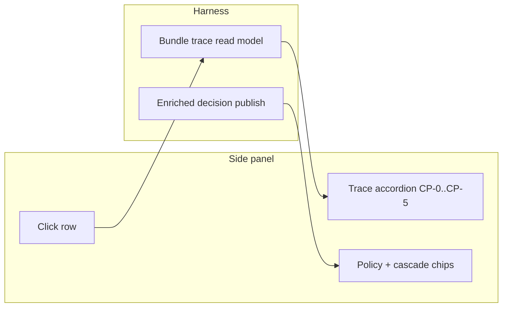

# Requirements: Explain This Post Demo Slice

## Summary

Formal requirements for the **Explain This Post** vertical slice: operators click a post in the side panel during replay and see the full harness gate chain (CP-0 through CP-5), harness policy (SHOW ≥ 40), scorer provenance, and full agent reasons — plus a rehearsal kit with three anchor bundle IDs for a repeatable 10-minute judge demo.

## Problem Frame

The Signal Density Filter harness already satisfied R6–R21 in backend code, but judges could not *see* checkpoints, Material Handler normalization, or harness-owned thresholds during the pitch. The side panel showed flat checkpoint logs and truncated reason codes; the worker-swap beat required terminal context; operators hunted for borderline posts mid-narration.

This slice closes the **demo-perception gap** between governed pipeline behavior and what is visible on stage — without expanding product scope beyond the hackathon demo.

## Key Decisions

**One vertical slice, three ideation survivors.** Bundle trace accordion (#1), cascade receipt + policy chip (#2), and demo rehearsal kit (#5) ship together as one demo path rather than three separate PRs.

**Click-to-expand in the side panel, not timeline steppers.** Trace investigation stays in the operator console during pillar narration; inline timeline accordions are deferred.

**Full agent reasons at commit, not UI-only expansion.** SHOW/HIDE decisions emit complete `agent_reasons` from the harness so SSE and REST stay authoritative.

**Rehearsal kit is a first-class deliverable.** Anchor bundle IDs and timed beats are requirements, not optional docs — demo reliability depends on scripted posts, not hunt-by-scroll.

**Blocked posts: trace on click, reveal as secondary action.** Blocked rows expand the gate chain on click; a separate control reveals the post on the timeline for the Guardrails beat.

## Actors

- **A1. Demo operator (builder)** — runs replay, clicks trace rows, narrates pillar beats from rehearsal kit.
- **A2. Judge (audience)** — watches side panel accordion and policy chips; does not operate the system.
- **A3. Chrome extension (thin client)** — renders trace accordion, policy chip, cascade chip; fetches trace via service worker.
- **A4. Harness backend** — assembles bundle trace, publishes enriched decision events.

## Key Flows

### F1. Trace investigation (Checkpoints + Material Handler beat)

**Trigger:** Operator clicks a checkpoint row, filtered HIDE row, blocked row, or recent decision row in the side panel.

1. Extension sends trace fetch for the row's bundle ID.
2. Harness returns assembled trace: normalized post, ordered checkpoint runs, latest decision, bundle-linked alarms, held state if pending.
3. Side panel expands inline accordion under the clicked row showing CP-0 through CP-5.
4. CP-0 displays normalized plain text and content hash (Material Handler beat).
5. CP-2 displays agent score, category, and reasons when present.
6. Failed stages show named reason codes (e.g. guardrail block at CP-1).
7. Only one accordion expanded at a time; clicking another row collapses the previous.

**Outcome:** Operator demonstrates gate chain and normalized input without curl or terminal.

### F2. Decision explainability (policy + cascade beat)

**Trigger:** Harness commits SHOW, HIDE, HOLD, or BLOCK and publishes a decision event.

1. Harness includes full agent reason list on the decision (not truncated to two codes for SHOW/HIDE).
2. Harness attaches human-readable policy label (e.g. `HIDE (score 39 < 40)`).
3. When tiered cascade ran, harness attaches cascade metadata: heuristic pre-score, whether LLM invoked, branch trigger, disagreement delta when applicable.
4. Side panel renders policy chip and cascade chip on filtered and decision rows.

**Outcome:** Operator answers "why 39 not 41?" and "which scorer produced this?" from the panel.

### F3. Demo rehearsal (AE7 extension)

**Trigger:** Operator prepares for judge demo using `demo-v1` replay.

1. Rehearsal kit documents three anchor bundle IDs and expected trace outcomes.
2. Kit provides 10-minute beat script aligned to four harness pillars.
3. Operator rehearses twice on replay with identical anchor outcomes.

**Outcome:** Demo completes without hunting posts or apologizing for invisible infrastructure.

## Requirements

### Trace investigation

- R1. The harness exposes a session-scoped bundle trace that assembles normalized post, ordered checkpoint runs (CP-0 → CP-5), latest decision, bundle-linked alarms, and pending held state when applicable.
- R2. Trace returns 404 when the session does not exist or the bundle belongs to a different session.
- R3. The extension fetches trace through the service worker (not direct harness calls from the side panel).
- R4. Checkpoint log rows, filtered HIDE rows, blocked rows, and recent decision rows are clickable and carry stable bundle IDs on the DOM.
- R5. Clicking a trace row toggles an inline accordion showing CP-0 through CP-5 with pass/fail styling and reason codes on failure.
- R6. CP-0 in the accordion shows normalized plain text and content hash so the Material Handler beat is visible without a separate panel section.
- R7. CP-2 in the accordion shows agent output summary (score, category, reasons) when the post was scored.
- R8. Only one trace accordion is expanded at a time across the side panel.
- R9. Blocked post rows offer a secondary action to reveal the post on the timeline without replacing trace-on-click as the primary interaction.

### Decision explainability

- R10. SHOW and HIDE decisions retain the full agent reason list at commit and in published decision events (not truncated to two codes).
- R11. Every published decision includes a human-readable policy label that states harness threshold rules for SHOW/HIDE and distinct wording for BLOCK and HOLD.
- R12. When the tiered scoring cascade ran, published decisions include cascade metadata: heuristic pre-score, LLM invoked flag, final worker, and disagreement delta when heuristic and LLM scores diverge materially.
- R13. The side panel renders policy and cascade chips on filtered and decision rows without requiring accordion expansion.

### Demo rehearsal

- R14. A rehearsal kit documents exactly three anchor bundle IDs on `demo-v1`: one guardrail BLOCK, one signal SHOW path, one borderline HOLD.
- R15. The rehearsal kit includes a timed beat script (≤10 minutes) covering live/replay opener, Material Handler + Checkpoints, Guardrails, explainability, Alarms, HITL resolve, and replay fallback narration.
- R16. The demo checklist includes explicit verification steps for trace drill-down and policy chip visibility during replay.

## Acceptance Examples

- AE1. **Covers R1, R5, R6, R7.** **Given** replay of `demo-v1` with extension side panel open, **when** the operator clicks a checkpoint row for `demo-signal-0`, **then** an accordion expands showing CP-0 normalized text, CP-2 agent output, and CP-5 committed SHOW.

- AE2. **Covers R1, R5, R9.** **Given** a guardrail-blocked post `demo-bait-0`, **when** the operator clicks the blocked row in the side panel, **then** the accordion shows CP-1 fail with a named `GUARDRAIL_*` code before any agent stage, and the operator can optionally reveal the post on the timeline.

- AE3. **Covers R10, R11, R13.** **Given** a HIDE decision with score 39, **when** the decision appears in the side panel, **then** the row shows a policy label referencing the SHOW threshold (40) and full agent reasons without truncation to two codes.

- AE4. **Covers R12, R13.** **Given** a post scored through both heuristic and LLM paths with score divergence, **when** the decision row renders, **then** a cascade chip indicates heuristic pre-score and LLM adjustment (including delta when disagreement exceeds threshold).

- AE5. **Covers R14, R15, R16.** **Given** an operator rehearsing from the rehearsal kit on replay, **when** timed, **then** all three anchor bundles are reachable by click without scroll-hunting and the script completes in ≤10 minutes.

- AE6. **Covers R8.** **Given** one trace accordion is expanded, **when** the operator clicks a different trace row, **then** the previous accordion collapses and only the new row's accordion is visible.

## Success Criteria

- Judges can see the gate chain and normalized input when the operator says "six checkpoints" — not just hear it.
- Operators answer score-threshold and scorer-provenance questions from the side panel without opening a terminal.
- The builder rehearses the kit twice on replay with identical anchor outcomes before live X.
- Demo checklist AE for trace drill-down and explainability chips passes on `demo-v1` replay.

## Scope Boundaries

### Deferred for later

- In-panel worker rescore (replay with alternate agent from side panel UI).
- Harness heartbeat and one-click offline replay boot.
- Held-row inline trace expand.
- Filtered-row and alarm-row trace parity beyond checkpoint/filtered/decision rows.
- Timeline inline pipeline stepper on badge click.

### Outside this slice's identity

- Author history enrichment.
- Standalone feed app or Chrome Web Store packaging.
- Full HITL queue management beyond one demonstrable borderline post.

## Dependencies / Assumptions

- Prior slices shipped SSE checkpoints, filtered posts panel, held queue, and replay fallback (`Alt+Shift+R`).
- `demo-v1` tape contains predictable bait, signal, and borderline posts with stable bundle IDs.
- Harness runs locally on localhost during demo; extension service worker can reach it.
- Heuristic-only replay satisfies all slice acceptance examples; LLM path enhances AE4 when API key is available.

## Outstanding Questions

### Deferred to planning

- OQ1. Whether to extend the same trace accordion to held-queue rows in a follow-on slice (plan 006 deferred item).
- OQ2. Whether cascade chip format should become user-configurable or remain fixed for demo clarity.

## Sources

- Origin ideation: `docs/ideation/2026-06-13-hackathon-demo-winning-ideation.md`
- Implementation plan: `docs/plans/2026-06-13-007-feat-explain-this-post-demo-slice-plan.md`
- Operator script: `docs/demo-rehearsal-kit.md`
- Parent requirements: `docs/brainstorms/2026-06-13-signal-density-filter-requirements.md` (R6–R12, R8, R15)
