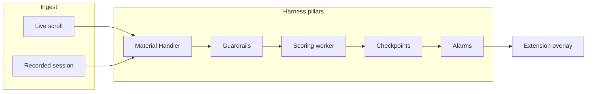

# Requirements: Signal Density Filter (Hackathon)

## Summary

A Chrome extension and local harness that aggressively filters a live X.com timeline for a 5-minute judge demo. The remembered moment is scrolling a noisy feed and watching low-signal posts disappear in real time. All four harness pillars receive a visible demo beat. If live X fails mid-pitch, the experience switches seamlessly to a pre-recorded session replay without changing what judges see.

## Problem Frame

X.com timelines are dominated by engagement bait and low-information noise. Users who follow hundreds of accounts have no structural way to surface the minority of posts worth reading. Existing browser filters can fade or hide posts, but they lack governed pipelines, named rejection reasons, checkpoint replay, or structured operator alarms.

This hackathon build exists to win a live demo, not to ship a daily-driver product. The builder has a detailed harness plan but has not yet used an existing filter tool or built a prototype. Demo reliability matters as much as live magic: a pitch that depends entirely on live X.com behaving is high risk for a solo builder.

## Key Decisions

**Live-first demo with invisible replay fallback.** Live filtering is the headline. Session replay is a reliability layer judges should not notice if live ingest fails.

**Aggressive default filtering.** Target hiding roughly 70% of posts in the demo scroll. Demo impact outweighs minimizing false positives during the pitch.

**All four pillars narrated.** Material Handler, Guardrails, Checkpoints, and Alarms each get one crisp beat in the 5-minute script. Human-in-the-loop review is part of the product story but may be pre-staged if time runs short.

**Author history deferred first.** Per-author enrichment is the first feature cut under schedule pressure.

**Agent scores, harness decides.** The scoring worker returns structured judgments. The harness owns SHOW, HIDE, HOLD, BLOCK, persistence, replay, and alarms.

## Actors

- A1. **Demo operator (builder)** — runs the pitch, acknowledges alarms if needed, may resolve one pre-staged borderline post.
- A2. **Judge (audience)** — watches the live scroll and pillar walkthrough; should not need to operate the system.
- A3. **Chrome extension (thin client)** — captures timeline posts, renders filter outcomes on the native X UI, displays alarm sidebar.
- A4. **Harness backend** — normalizes posts, enforces guardrails and checkpoints, routes decisions, persists runs, emits alarms.
- A5. **Scoring worker (swappable agent)** — scores normalized posts; default is LLM classifier, swappable to heuristic classifier for agent-swap demo beat.

## Key Flows

### F1. Live filtering (primary demo path)

**Trigger:** Operator opens X.com with extension active in live mode.

1. Extension captures visible posts and sends them to the harness.
2. Material Handler normalizes each post into a stable struct the agent will see.
3. Guardrails evaluate declared rules before the agent runs. Failures block with a named reason code.
4. Scoring worker returns signal score, category, reasons, confidence, and optional escalation flag.
5. Checkpoints validate agent output through explicit pass/fail gates.
6. Harness commits SHOW, HIDE, HOLD, or BLOCK.
7. Extension updates the timeline overlay and alarm sidebar via real-time events.
8. Session is recorded in the background for replay fallback.

**Outcome:** Low-signal posts disappear or dim as the operator scrolls. Judges perceive a cleaner feed in real time.

### F2. Seamless replay fallback

**Trigger:** Live ingest fails or becomes unreliable during the pitch (DOM breakage, empty feed, unacceptable latency).

1. Operator switches to replay mode without changing extension UI layout.
2. Harness replays a pre-recorded session through the same pipeline stages.
3. Extension receives the same decision and alarm events as in live mode.
4. Demo script continues through remaining pillar beats.

**Outcome:** Judges cannot tell the transition was not live. Narration does not apologize for infrastructure failure.

### F3. Five-minute demo script (pillar beats)

**Trigger:** Operator starts the judge demo.

| Segment | Beat | Pillar |
|---------|------|--------|
| 0:00–1:30 | Scroll live noisy feed; junk disappears | End-to-end filtering |
| 1:30–2:00 | Show one blocked post with named guardrail reason | Guardrails |
| 2:00–2:30 | Show normalized input the agent received | Material Handler |
| 2:30–3:30 | Open checkpoint log; replay one decision from a mid-pipeline gate | Checkpoints |
| 3:30–4:00 | Alarm sidebar shows structured session alarms | Alarms |
| 4:00–4:30 | Resolve one borderline held post (pre-staged acceptable) | Human-in-the-loop |
| 4:30–5:00 | Swap scoring worker; same posts, different scores | Swappable agent |

**Outcome:** All pillars are visible. One remembered live-filtering moment anchors the pitch.

## Requirements

### Demo experience

- R1. The primary demo path filters a live X.com timeline while the operator scrolls at normal speed.
- R2. The default filter hides approximately 70% of posts in a typical noisy demo scroll without manual per-post intervention.
- R3. Filter outcomes are visible on the native X timeline (hide, dim, or badge) without navigating away from x.com.
- R4. If live ingest fails during the pitch, the operator can switch to replay mode without changing the extension UI the judges are watching.
- R5. The full 5-minute demo script completes with all four harness pillars each receiving one narrated beat.

### Harness pillars

- R6. Material Handler normalizes captured posts into a stable struct. The scoring worker only receives normalized material, never raw page HTML.
- R7. Guardrails are declared rules evaluated before the agent runs. Failed guardrails block with a named reason code and are never silently dropped.
- R8. Checkpoints are explicit pass/fail gates on agent output. Every run persists its checkpoint stage so any run can be replayed from a chosen gate forward without re-running earlier successful stages.
- R9. Alarms are structured events with severity and recommended action. They stream to the extension sidebar in real time during live and replay modes.

### Filtering decisions

- R10. The harness commits one of SHOW, HIDE, HOLD, or BLOCK per post. Threshold defaults: SHOW at signal score 40 or above, HIDE below 40.
- R11. Posts the agent marks for escalation, or low-confidence judgments on high-reach accounts, enter HOLD rather than auto SHOW or HIDE.
- R12. Every rejection and hold is attributable to a named reason code visible to the operator.

### Scoring workers

- R13. Two scoring workers ship behind one interface: an LLM classifier (default) and a heuristic classifier (no external API).
- R14. Swapping scoring workers requires no harness code changes — configuration only.
- R15. The demo includes a worker-swap beat on the same post set showing different scores from different workers.

### Human-in-the-loop

- R16. The extension shows a count of held posts awaiting review.
- R17. The operator can resolve a held post as Show, Hide, or Block and see the agent's reasoning.
- R18. At minimum one borderline post is demonstrable in the pitch. A full queue management UX is desirable but not required if schedule is tight.

### Session recording and replay

- R19. Live sessions are recorded automatically so the same post set can be replayed through the harness later.
- R20. Replay produces the same decision and alarm events the extension expects in live mode.
- R21. Replay supports starting from a named checkpoint gate and optionally swapping the scoring worker mid-replay.

## Acceptance Examples

- AE1. **Covers R1, R2, R3.** **Given** a logged-in X.com home timeline with at least 30 visible posts in a 60-second scroll, **when** the operator scrolls at normal speed with the extension active, **then** at least 70% of captured posts receive HIDE or BLOCK and the feed visibly differs from the unfiltered timeline.

- AE2. **Covers R4, R20.** **Given** live ingest has stopped producing new posts, **when** the operator activates replay mode, **then** the extension overlay and alarm sidebar continue updating without a visible UI layout change and without requiring the operator to explain a mode switch to judges.

- AE3. **Covers R7, R12.** **Given** a post fails a guardrail rule (too short, duplicate within 24 hours, blocked account, known bait pattern, spam domain, or older than 72 hours), **when** the harness evaluates it, **then** the post is blocked before the agent runs and the spike or sidebar shows the specific named reason code.

- AE4. **Covers R8, R21.** **Given** a recorded session with at least one scored post, **when** the operator replays from a mid-pipeline checkpoint after changing the scoring worker, **then** the post receives a new decision trace without re-ingesting from X.com.

- AE5. **Covers R13, R14, R15.** **Given** the same recorded post set, **when** the operator swaps from LLM to heuristic scoring worker and replays, **then** at least one post shows a meaningfully different score or decision.

- AE6. **Covers R16, R17, R18.** **Given** at least one post in HOLD state, **when** the operator opens the review UI and chooses Hide, **then** the post state updates and the held count decrements.

- AE7. **Covers R5.** **Given** a rehearsal of the demo script, **when** timed, **then** all four pillar beats and the live-filtering opener fit within 5 minutes without skipping a pillar.

## Success Criteria

- Judges describe the demo as "my feed got quiet while I watched" rather than "they showed me a dashboard."
- The pitch completes without apologizing for infrastructure, even if live X was flaky behind the scenes.
- Agent swap and checkpoint replay each land as distinct "harness, not just an LLM wrapper" moments.
- The builder can rehearse the full script twice consecutively with identical outcomes when using replay mode.

## Scope Boundaries

### Deferred for later

- Author history enrichment and per-handle signal profiles.
- Daily-driver polish: onboarding, settings sync, multi-session learning, cloud deployment.
- Full human-in-the-loop queue UX beyond one demonstrable borderline post.
- Multi-platform adapters beyond X.com.

### Outside this product's identity

- Replacing X.com with a standalone filtered feed app.
- Training or fine-tuning custom models.
- Publishing to the Chrome Web Store as a v1 deliverable.

## Dependencies / Assumptions

- Operator has a logged-in X.com account suitable for demo scrolling.
- Operator has API access for the default LLM scoring worker during development and demo rehearsal.
- Operator can run a local harness process the extension can reach during the demo.
- A rehearsal pass on synthetic or recorded posts is needed to tune thresholds before the pitch because the builder has not yet validated filter aggressiveness against real feed content.
- X.com DOM or internal API shapes may change; replay fallback is assumed necessary, not optional.

## Outstanding Questions

### Deferred to planning

- OQ1. Exact mechanism for seamless live-to-replay switch (operator gesture vs automatic detection vs pre-bound hotkey).
- OQ2. Whether HITL ships as a minimal one-post demo or a fuller queue if build time allows.
- OQ3. Category taxonomy enum values for agent output (required by checkpoints but not yet enumerated).
