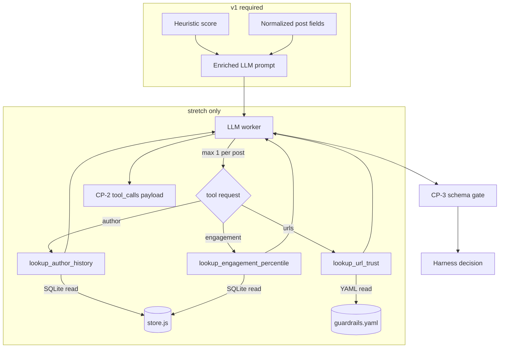

# Agent Tools for Scoring Worker

## Summary

Define a demo-safe tool surface for the LLM scoring worker. v1 ships mandatory prompt enrichment (zero latency cost). Stretch adds three read-only local tools — `lookup_author_history`, `lookup_url_trust`, and `lookup_engagement_percentile` — as narratable harness beats. No external fetch tools, no multi-turn loops. (see origin: `docs/brainstorms/2026-06-13-signal-density-filter-requirements.md`; extends U5/U11 in `docs/plans/2026-06-13-signal-density-filter-plan.md`)

## Problem Frame

The LLM scorer today sees only `@handle` and `text` (`harness/agents/llm-classifier.js`), while the harness normalizes richer material (`shared/schemas/normalized-post.json`) and applies policy the agent never sees (`harness/pipeline/decision.js`). Judges need a governed harness, not an LLM wrapper. Tools must stay inside the tiered cascade (`harness/pipeline/cascade.js`), respect the 2s `agent_latency` alarm (`harness/pipeline/alarms.js`), preserve replay determinism (AE4/AE5), and keep `AGENT=heuristic` fully functional (R13–R15).

---

## Requirements

- R-T1. Gray-band LLM calls receive normalized context already in schema: `urls`, `engagement`, `posted_at`, plus heuristic pre-score and reasons.
- R-T2. Agent output contract unchanged per `shared/schemas/agent-output.json`.
- R-T3. `AGENT=heuristic` invokes zero tools and zero network.
- R-T4. Stretch: three read-only local tools — `lookup_author_history`, `lookup_url_trust`, and `lookup_engagement_percentile` — no HTTP, no X API.
- R-T9. Agent may invoke at most one tool per post; harness executes whichever the LLM requests first.
- R-T5. Tool calls are auditable in checkpoint log for demo narration.
- R-T6. Replay from CP-2+ reuses persisted tool I/O; no re-query during replay.
- R-T7. Tool timeout or failure does not block pipeline — score continues without tool data.
- R-T8. Guardrail BLOCK, HOLD policy, and alarms remain harness-owned — not agent tools.

---

## Key Technical Decisions

- KTD-T1: **Prompt enrichment before tool-calling.** Pass cascade heuristic result + normalized fields into the LLM prompt. Closes the engagement/HOLD visibility gap at zero latency cost. Required for v1.
- KTD-T2: **Three stretch tools — author, URL, and engagement context.** `lookup_author_history` queries SQLite for prior decisions by `author_handle` in current session. Returns `{ post_count, avg_signal_score, hide_rate, recent_categories[] }`. `lookup_url_trust` matches post URLs against `harness/config/guardrails.yaml` `spam_domains` and new `trusted_domains`. Returns `{ results: [{ url, trust: 'spam'|'trusted'|'unknown' }] }`. `lookup_engagement_percentile` compares this post's `engagement.likes` to the session distribution from SQLite. Returns `{ likes, session_median_likes, percentile, is_high_reach }` where `is_high_reach` uses the same 10k threshold as `harness/pipeline/decision.js`. None of the tools BLOCK or HOLD — they inform scoring only.
- KTD-T3: **Harness-side tool executor.** Tools live in `harness/agents/tools/`. Agent requests; harness executes with injected `store`, `sessionId`, and guardrail config. Max **1 tool call per post** (agent picks one), 500ms timeout per call.
- KTD-T4: **Persist tool I/O in CP-2 checkpoint payload.** Shape: `tool_calls: [{ name, input, output, latency_ms, status }]`. Replay with `fromStage >= CP-2` skips re-execution.
- KTD-T5: **No external fetch tools.** Live URL verification, WHOIS, and web search excluded — break replay determinism. Local config lookup via `lookup_url_trust` is in scope.
- KTD-T6: **Demo tape seeds tool beats on different posts.** Author-history beat uses `promo_co` (not in `blocked_accounts`) with 2–3 early low-score posts. URL-trust beat uses a borderline `tech_analyst` post with `https://example.com/...` matched by new `trusted_domains` entry. Engagement-percentile beat uses a borderline `news_bot` post with `engagement.likes: 12000` after earlier session posts establish a lower median. `bait_bot_99` stays guardrail-blocked (AE3) and never reaches the agent.
- KTD-T7: **`lookup_url_trust` is config lookup, not fetch.** Reuses guardrails YAML; does not duplicate CP-1 spam BLOCK (those posts never reach the agent). Tool value is classifying borderline links the guardrail list does not hard-block.
- KTD-T8: **`lookup_engagement_percentile` mirrors decision policy context, not policy itself.** Surfaces relative reach so the LLM can lower confidence or set `escalate: true` on viral borderline posts. Harness still owns `LOW_CONFIDENCE_HIGH_REACH` HOLD in `decision.js`; the tool does not commit HOLD.

---

## What NOT to Give the Agent

| Capability | Owner | Rationale |
|------------|-------|-----------|
| Duplicate detection, bait regex, spam domain, stale post | `harness/pipeline/guardrails.js` | Deterministic pre-agent BLOCK (R7, AE3) |
| SHOW/HIDE/HOLD/BLOCK thresholds | `harness/pipeline/decision.js` | KTD2 separation; engagement HOLD stays harness-owned |
| Heuristic signals (emoji, CTA, citations) | `harness/agents/heuristic-classifier.js` | Must work with `AGENT=heuristic` |
| Hard spam-domain BLOCK | `harness/pipeline/guardrails.js` | CP-1; agent never sees those posts |
| URL fetch / live fact-check | Out of scope | Latency + non-deterministic replay |
| Full author profiles (origin KTD9 deferral) | Post-hackathon | Beyond one lookup beat |

**Rule:** Tools supply optional read-only context for gray-zone LLM scoring. Anything that can BLOCK, HOLD, or alarm without LLM judgment stays in the harness.

---

## High-Level Technical Design

| Tool | v1 | Stretch | Latency | Replay-safe |
|------|----|---------|---------|-------------|
| Prompt enrichment | Yes | Yes | ~0ms | Yes |
| `lookup_author_history` | No | Yes | <50ms local | Yes if CP-2 cached |
| `lookup_url_trust` | No | Yes | <10ms local | Yes if CP-2 cached |
| `lookup_engagement_percentile` | No | Yes | <50ms local | Yes if CP-2 cached |

---

## Implementation Units

### U1. Enrich LLM prompt with normalized + heuristic context

**Goal:** Give the LLM everything the harness already knows without adding tool infrastructure.

**Requirements:** R-T1, R-T2

**Dependencies:** None (extends existing U5/U11)

**Files:**
- `harness/agents/llm-classifier.js`
- `harness/pipeline/cascade.js`
- `harness/tests/llm-agent.test.js`

**Approach:** `runCascade` passes `heuristicResult` into `scoreWithLlm`. Prompt adds `urls[]`, `engagement` summary, `posted_at`, heuristic `signal_score`, `reasons`, and `escalate` flag. Output schema unchanged.

**Patterns to follow:** Existing `mockResponse` bypass in `harness/tests/llm-agent.test.js`; cascade passes `llmOptions` today.

**Test scenarios:**
- Happy path: gray-band post — prompt includes heuristic score 45 and reasons
- Happy path: post with URLs — prompt lists extracted URLs
- Edge case: post with `engagement.likes: 15000` — prompt includes engagement; harness HOLD still driven by `decision.js`
- Integration: `mockResponse` path still validates against agent-output schema

**Verification:** `npm test` passes; demo tape borderline posts show richer reasoning in agent `reasons[]`

---

### U2. Tool executor framework (stretch)

**Goal:** Minimal harness-side registry for read-only tools with timeout and error handling.

**Requirements:** R-T4, R-T7

**Dependencies:** U1

**Files:**
- `harness/agents/tools/index.js` (new)
- `harness/agents/tools/lookup-author-history.js` (new)
- `harness/agents/tools/lookup-url-trust.js` (new)
- `harness/agents/tools/lookup-engagement-percentile.js` (new)
- `harness/config/guardrails.yaml` (add `trusted_domains`)
- `harness/tests/tools.test.js` (new)

**Approach:** `executeTool(name, input, { store, sessionId, guardrailConfig, timeoutMs: 500 })` registers all three stretch tools. `lookup_engagement_percentile` accepts `{ likes }` (defaulting from normalized post) and queries session bundles for median/percentile. Returns `{ status, output, latency_ms }`. Never throws.

**Patterns to follow:** Guardrails store lookup pattern in `harness/pipeline/guardrails.js`; in-memory store tests in `harness/tests/store.test.js`.

**Test scenarios:**
- Happy path: author with 3 prior HIDE decisions — `hide_rate` reflects history
- Happy path: URL matching `trusted_domains` — `trust: 'trusted'`
- Happy path: post with 12k likes in session median ~200 — `percentile` ≥ 90, `is_high_reach: true`
- Happy path: URL matching `spam_domains` — `trust: 'spam'` (informational; post would normally be CP-1 blocked)
- Edge case: new author — `{ post_count: 0, avg_signal_score: null, hide_rate: 0 }`
- Edge case: first post in session — `session_median_likes: null`, `percentile: null`
- Edge case: missing `engagement` — `{ likes: 0, session_median_likes, percentile, is_high_reach: false }`
- Edge case: URL with no config match — `trust: 'unknown'`
- Edge case: empty `urls` input — `{ results: [] }`
- Error path: simulated DB error — `status: 'error'`, no throw
- Error path: timeout at 500ms — `status: 'timeout'`

**Verification:** Tool unit tests pass in isolation

---

### U3. LLM tool-use loop (stretch)

**Goal:** Wire Anthropic tool-use for all three stretch tools on LLM path only.

**Requirements:** R-T3, R-T4, R-T7

**Dependencies:** U2

**Files:**
- `harness/agents/llm-classifier.js`
- `harness/agents/index.js`
- `harness/pipeline/cascade.js`
- `harness/tests/cascade.test.js`

**Approach:** All three tools available only when `agent.type === 'llm'` and cascade entered LLM path. Max 1 tool round-trip per post (R-T9). On failure, score from prompt context only. `AGENT=heuristic` never loads tool definitions. System prompt nudges: `lookup_author_history` when author track record is ambiguous; `lookup_url_trust` when URLs present and citation quality unclear; `lookup_engagement_percentile` when engagement looks high but signal quality is borderline.

**Patterns to follow:** Existing LLM fallback in `cascade.js` (`llm_fallback: true`); `mockResponse` in tests.

**Test scenarios:**
- Happy path: `AGENT=llm`, gray-band post with URLs, mocked `lookup_url_trust` — final output passes CP-3
- Happy path: `AGENT=llm`, gray-band post, mocked `lookup_author_history` — final output passes CP-3
- Happy path: `AGENT=llm`, gray-band high-reach post, mocked `lookup_engagement_percentile` — agent may set `escalate: true`; harness HOLD still driven by `decision.js`
- Edge case: LLM requests second tool in same turn — harness rejects; score proceeds with first tool result only
- Edge case: `AGENT=heuristic`, borderline post — zero tool invocations
- Edge case: `AGENT=llm`, obvious bait (heuristic <30) — LLM and tool not invoked
- Error path: tool OK + malformed LLM JSON — HOLD + `schema_violation`
- Integration: `mockResponse` bypasses tool loop entirely

**Verification:** Cascade tests cover tool-on and tool-off paths

---

### U4. Checkpoint tool trace persistence (stretch)

**Goal:** Make tool calls visible in checkpoint log for demo narration and replay determinism.

**Requirements:** R-T5, R-T6

**Dependencies:** U3

**Files:**
- `harness/pipeline/checkpoints.js`
- `harness/pipeline/processor.js`
- `harness/tests/replay.test.js`

**Approach:** CP-2 `payload` includes `tool_calls[]`. Replay with `fromStage >= CP-2` or `existingAgentOutput` skips tool re-execution.

**Patterns to follow:** Existing checkpoint payload recording in `processor.js`; replay from stage in `harness/replay/tape-player.js`.

**Test scenarios:**
- Happy path: full tape replay ×2 — identical decisions on tool-assisted posts
- Edge case: replay `--from CP-3` — no tool re-invocation
- Integration: checkpoint log query returns `tool_calls` for operator UI beat

**Verification:** Covers AE4-style replay test with tool cache

---

### U5. Demo tape seeding and script beat (stretch)

**Goal:** Rehearseable tool narration on `tapes/demo-v1` without live X.

**Requirements:** R-T5

**Dependencies:** U4

**Files:**
- `corpora/demo.yaml`
- `scripts/seed-tape.js`
- `docs/demo-script.md`

**Approach:** Three demo beats on different posts. (1) Seed 2–3 early `promo_co` posts with low scores; later borderline `promo_co` post triggers `lookup_author_history`. (2) Borderline `tech_analyst` post with `https://example.com/fed` triggers `lookup_url_trust` after `trusted_domains` includes `example.com`. (3) Borderline `news_bot` post with `engagement.likes: 12000` triggers `lookup_engagement_percentile` once earlier tape posts establish a lower session median. Script beats: *"The agent asked the harness for author history"*, *"whether this link is trusted"*, and *"how viral this post is relative to the session."*

**Test scenarios:**
- Happy path: after full demo tape, `promo_co` lookup returns `post_count >= 2`
- Happy path: `tech_analyst` borderline post URL returns `trust: 'trusted'`
- Happy path: `news_bot` borderline post returns `is_high_reach: true` and `percentile` ≥ 90
- Integration: each tool-assisted post decision differs from mock no-tool run on same input

**Verification:** Operator narrates all three tool beats twice consecutively on replay with identical outcomes

---

## Scope Boundaries

### In scope

- Prompt enrichment (v1 required)
- Three local read-only tools (stretch)
- Checkpoint tool trace (stretch)
- Demo tape seeding for tool beat (stretch)

### Deferred to follow-up work

- External URL fetch / live domain reputation APIs
- Semantic near-duplicate detection
- Full per-handle signal profiles (origin KTD9)
- Multi-turn tool loops or MCP integration
- Tool trace in extension UI (checkpoint log in side panel is sufficient)

### Outside product identity

- Agent tools that auto-BLOCK or auto-SHOW without harness decision step
- Fine-tuning models on author history

---

## Risks and Mitigations

| Risk | Mitigation |
|------|------------|
| Tool + LLM exceeds 2s latency alarm | 500ms tool timeout; U1 reduces unnecessary tool calls; heuristic-only fallback |
| Replay diverges after tool use | KTD-T4: persist tool I/O in CP-2; replay skips re-execution |
| 70% hide rate drops if tools rescue borderline posts | Seed consistent low history for `promo_co`; URL trust informs but does not override threshold |
| `bait_bot_99` blocked at guardrail breaks author-history demo | Use `promo_co` for author beat; keep `bait_bot_99` for AE3 guardrail demo only (KTD-T6) |
| Solo time overrun | U1 ships first; U2–U5 gated behind passing replay tests |
| Tool blurs guardrail vs agent boundary | KTD-T5; blocked accounts stay in guardrails |
| Engagement tool duplicates HOLD policy | KTD-T8: tool informs confidence/escalate; `decision.js` still commits HOLD |

---

## Build Sequence

| Priority | Units | Milestone |
|----------|-------|-----------|
| v1 required | U1 | LLM sees full context; no new infrastructure |
| Stretch | U2 → U3 → U4 → U5 | Tool beat rehearsable on demo tape |

**Gate:** Do not start U2 until U1 passes and demo tape replay satisfies AE4/AE5 on the parent plan. Do not narrate tool beat unless U4 replay test passes.

---

## Acceptance Scenarios

- AE-T1. Gray-band LLM prompt includes engagement, URLs, and heuristic pre-score (R-T1)
- AE-T2. `AGENT=heuristic` full demo path invokes zero tools (R-T3)
- AE-T3 (stretch). Checkpoint log shows `lookup_author_history` for `promo_co` borderline post (R-T5)
- AE-T6 (stretch). Checkpoint log shows `lookup_url_trust` for `tech_analyst` borderline post with URL (R-T5)
- AE-T8 (stretch). Checkpoint log shows `lookup_engagement_percentile` for `news_bot` high-reach borderline post (R-T5)
- AE-T4 (stretch). Two consecutive replay runs produce identical decisions on tool-assisted posts (R-T6)
- AE-T5 (stretch). Tool timeout → post still receives valid decision, not stuck HOLD (R-T7)
- AE-T7 (stretch). Post receives at most one tool call even when all three tools are registered (R-T9)
