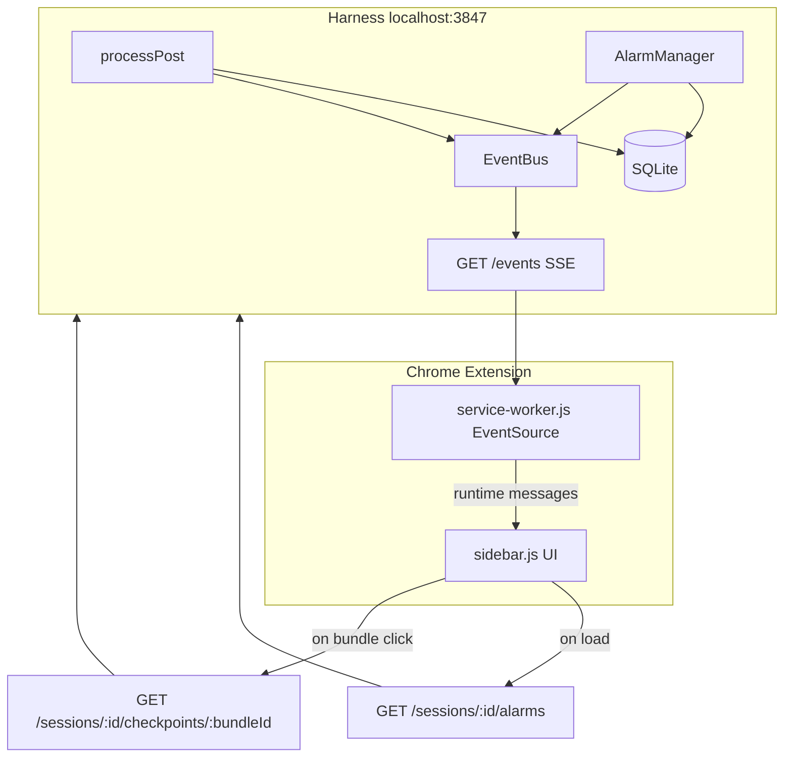

# Observability — Harness Completion and Extension Side Panel

## Summary

Complete the observability path from harness pipeline to operator UI: wire missing SSE checkpoint events and alarm triggers, add session alarm history API, and build the Chrome MV3 side panel that consumes `GET /events` for demo pillar beats (Checkpoints ~2:30, Alarms ~3:30, HITL held count ~4:00). (see origin: `docs/brainstorms/2026-06-13-signal-density-filter-requirements.md`; extends U8 and U10 in `docs/plans/2026-06-13-signal-density-filter-plan.md`)

## Problem Frame

The harness already persists decisions, checkpoint runs, and alarms in SQLite and streams some events via SSE, but the operator has no UI to see them. The extension workspace is a stub (`extension/package.json` only). Two alarm types are defined but never fire; checkpoint SSE publish logic exists in `recordCheckpoint()` but callers omit `eventBus`. Without the side panel, judges see posts disappear but not the governed harness story — R9 and the Checkpoints/Alarms demo beats cannot land.

This plan does not rebuild observability from scratch. It closes the gaps between existing harness code and the demo script in F3 of the origin requirements.

---

## Requirements

Requirements trace to origin R8, R9, R16 and main-plan U8/U10. IDs are continuous within this plan.

### Real-time event stream

- R1. All four SSE event types — `decision`, `alarm`, `checkpoint`, `held_count` — emit during live ingest and tape replay through the same pipeline.
- R2. Checkpoint events include `bundle_id`, `session_id`, `stage`, `status`, and `reason_code` (snake_case, matching existing publish shape in `harness/pipeline/processor.js`).
- R3. Alarm events match `shared/schemas/alarm.json` and persist before SSE emit (existing `AlarmManager.fire()` behavior).

### Alarm completeness

- R4. `confidence_collapse` fires when low-confidence agent scores exceed a configurable threshold in a rolling window (mirror `high_block_rate` pattern in `harness/pipeline/alarms.js`).
- R5. `escalation_queue_full` fires when pending held-post count reaches a threshold after a HOLD decision.

### Session history API

- R6. `GET /sessions/:sessionId/alarms` returns alarms for a session ordered by `created_at`, for side-panel hydration on connect/reconnect.
- R7. Existing `GET /sessions/:sessionId/checkpoints/:bundleId` remains the authoritative bundle trace; side panel uses it for drill-down.

### Extension side panel (operator observability UI)

- R8. Side panel subscribes to `http://localhost:3847/events` via background service worker and renders incoming events without page reload.
- R9. Alarm stream shows `severity`, `message`, and `recommended_action` for each alarm, newest first, capped at last 50.
- R10. Checkpoint log shows last N checkpoint events (default 20) with stage, status, bundle id (truncated), and reason code on failure.
- R11. Held-post badge shows live `held_count` from SSE and links to held-post list via `GET /hitl/:sessionId/held`.
- R12. Session mode indicator shows `live` vs `replay` from extension state (updated on `Alt+Shift+R` hotkey per KTD1 in main plan).

### Demo reliability

- R13. Replay mode (`npm run replay` or tape player via harness) produces the same SSE event types as live ingest so the side panel can be rehearsed without X.com.
- R14. Demo tape includes at least one scenario that triggers a visible alarm during replay (guardrail block streak or held-post threshold).

---

## Key Technical Decisions

- KTD1: **Side panel before timeline overlay.** U10 observability can be demoed with replay + side panel alone; overlay (U9) depends on X DOM and is out of scope here. Resolves demo ordering: harness SSE consumer validates R9 before scrape risk.
- KTD2: **Service worker owns EventSource.** MV3 content scripts cannot reliably hold long-lived SSE connections; background service worker connects to `/events` and forwards typed messages to the side panel via `chrome.runtime.sendMessage`. (see pattern in main plan KTD5)
- KTD3: **Hydrate alarms on panel open.** SSE is forward-only; on side panel load, fetch `GET /sessions/:id/alarms` then subscribe to SSE for new events. Checkpoints hydrate per-bundle on click via existing REST endpoint — not bulk-loaded on open.
- KTD4: **Pass `eventBus` through all `processPost` call sites.** Fix is threading `deps.eventBus` from ingest router and `tape-player.js` into `processPost` deps and passing it to every `recordCheckpoint()` call (helper already supports optional fifth argument).
- KTD5: **Alarm thresholds as constants in `alarms.js`.** `CONFIDENCE_COLLAPSE_THRESHOLD`: 5 of last 10 scores with confidence < 0.5; `ESCALATION_QUEUE_THRESHOLD`: 3 pending held posts. No YAML config for v1 — demo tuning is code constants with tests.
- KTD6: **Vanilla JS, no build step.** Match main plan KTD6; side panel is plain HTML/CSS/JS loaded by MV3.

---

## High-Level Technical Design

**Event flow per post:** ingest → `processPost` → `recordCheckpoint` (SSE `checkpoint`) → decision → SSE `decision` → `alarmManager.recordDecision` (may SSE `alarm`) → if HOLD, SSE `held_count`.

---

## Scope Boundaries

**In scope:** Harness SSE/alarm completion, alarms REST endpoint, extension MV3 shell, service worker SSE bridge, side panel for alarms/checkpoints/held count/mode indicator, integration tests, demo tape alarm seeding.

**Out of scope (see main plan):**
- Timeline scrape and overlay (U9) — separate work; side panel does not require X.com
- Full HITL resolve UI (U13) — held list display only; resolve can stay REST/curl for v1
- OpenTelemetry, metrics backends, structured logging — not demo-critical
- Tool trace UI in checkpoint log (agent-tools plan R-T5) — deferred; checkpoint stages suffice for Checkpoints pillar beat

### Deferred to Follow-Up Work

- SSE reconnect with exponential backoff and missed-event replay from SQLite
- Bulk checkpoint session export (`GET /sessions/:id/checkpoints`)
- Side panel styling polish beyond readable demo defaults

---

## Implementation Units

### U1. Wire checkpoint SSE and missing alarm triggers

**Goal:** All four SSE event types and five alarm types fire from the real pipeline.

**Requirements:** R1, R2, R3, R4, R5

**Dependencies:** None

**Files:**
- `harness/pipeline/processor.js`
- `harness/pipeline/alarms.js`
- `harness/routes/sessions.js`
- `harness/replay/tape-player.js`
- `harness/tests/alarms.test.js`
- `harness/tests/processor-sse.test.js` (new)

**Approach:** Pass `eventBus` from ingest and tape-player into `processPost` and through to every `recordCheckpoint()` call. Add `recordAgentConfidence(sessionId, confidence, bundleId)` to AlarmManager; call from processor after successful CP-4. Call `escalationQueueFull` when `heldCount >= ESCALATION_QUEUE_THRESHOLD` after HOLD insert. Publish `held_count` after escalation alarm path if not already emitted.

**Patterns to follow:** Existing `recordCheckpoint` publish shape in `harness/pipeline/processor.js`; `high_block_rate` window logic in `harness/pipeline/alarms.js`.

**Test scenarios:**
- Ingest one post through `processPost` with in-memory store and mock eventBus; assert `checkpoint` events emitted for CP-0, CP-1, and subsequent stages through CP-5.
- Ten consecutive BLOCK decisions fire exactly one `high_block_rate` alarm (existing test pattern).
- Five of ten agent outputs with confidence 0.3 fire `confidence_collapse`.
- Third HOLD in session fires `escalation_queue_full`.
- Tape replay with eventBus emits `checkpoint` events (not just `decision`).

**Verification:** `npm test --workspace=harness` passes; manual `npm run replay -- --tape demo-v1` with EventSource listener shows checkpoint events.

---

### U2. Session alarms REST endpoint

**Goal:** Side panel can hydrate alarm history on open.

**Requirements:** R6, R7

**Dependencies:** U1

**Files:**
- `harness/db/store.js`
- `harness/routes/sessions.js`
- `harness/tests/store.test.js`
- `harness/tests/sessions-api.test.js` (new)

**Approach:** Add `getAlarmsBySession(sessionId)` to store mirroring `getDecisionsBySession` shape. Add `GET /sessions/:sessionId/alarms` on sessions router returning array ordered by `created_at ASC`.

**Test scenarios:**
- Insert two alarms for session; GET returns both in order with snake_case JSON fields.
- GET for unknown session returns 404 (match existing session route behavior).
- Empty session returns `[]`.

**Verification:** curl against running harness returns alarm rows after replay triggers block-rate alarm.

---

### U3. Extension MV3 shell and SSE service worker

**Goal:** Extension loads, connects to harness SSE, forwards events to side panel.

**Requirements:** R8, R13

**Dependencies:** U1

**Files:**
- `extension/manifest.json`
- `extension/background/service-worker.js`
- `extension/lib/sse-client.js` (new)
- `extension/lib/session.js` (new — session id storage)

**Approach:** MV3 manifest with `side_panel` default path, `host_permissions` for `http://localhost:3847/*`, background service worker. On install/startup, read or create `session_id` in `chrome.storage.local`, connect EventSource to `/events`, parse `event:` / `data:` lines (match `harness/tests/sse.test.js` parser), broadcast `{ type, data }` to side panel listeners. Expose `GET_SESSION` / `SET_SESSION` messages for panel. Session creation: `POST /sessions` on first connect if no stored id.

**Patterns to follow:** SSE wire format from `harness/routes/events.js`; snake_case payloads from ingest publish calls in `harness/routes/sessions.js`.

**Test scenarios:**
- Test expectation: none — MV3 extension; manual checklist in U5 verification.

**Verification:** Load unpacked extension; open side panel; run harness + replay; service worker logs show received `decision` and `alarm` events.

---

### U4. Side panel — alarm stream, checkpoint log, held count

**Goal:** Operator observability UI for demo pillar beats.

**Requirements:** R9, R10, R11, R12

**Dependencies:** U2, U3

**Files:**
- `extension/sidebar/sidebar.html`
- `extension/sidebar/sidebar.css`
- `extension/sidebar/sidebar.js`

**Approach:** Three sections in panel: (1) **Alarms** — on load fetch `/sessions/:id/alarms`, then append SSE `alarm` events; color by severity (`critical` red, `warning` amber, `info` blue). (2) **Checkpoints** — ring buffer of last 20 SSE `checkpoint` events; clicking a row fetches `/sessions/:id/checkpoints/:bundleId` and expands inline stage list. (3) **Status bar** — mode badge (`live`/`replay`), held count from SSE `held_count`, link button to fetch held posts JSON in expandable section.

Register `Alt+Shift+R` in service worker to `PATCH /sessions/:id/mode` with `{ mode: 'replay', tape_id: 'demo-v1' }` and update badge (full replay orchestration stays in U12 main plan; this unit only toggles indicator + notifies panel).

**Patterns to follow:** Demo beat timing from origin F3; alarm schema fields in `shared/schemas/alarm.json`.

**Test scenarios:**
- Test expectation: none — manual demo checklist.

**Verification:** With harness running and `npm run replay -- --tape demo-v1`, side panel shows alarms, checkpoint stages scrolling, held count updates; checkpoint row click shows CP-0…CP-5 for one bundle.

---

### U5. Pipeline SSE integration test and demo tape alarm seeds

**Goal:** Automated proof that observability events flow end-to-end; replay reliably shows alarms for demo rehearsal.

**Requirements:** R14

**Dependencies:** U1, U4

**Files:**
- `harness/tests/pipeline-sse.test.js` (new)
- `tapes/demo-v1/posts.jsonl` (seed posts if needed)
- `corpora/demo.yaml` (if seed script uses it)
- `docs/demo-checklist.md` (new — observability section)

**Approach:** Integration test: create session, ingest batch of guardrail-blocking posts via `POST /ingest`, collect events from EventBus subscriber, assert at least one `alarm`, multiple `checkpoint`, and `decision` events in pipeline order. Ensure demo tape includes 10+ engagement-bait posts (for `high_block_rate`) and one borderline HOLD post (for held count / escalation).

**Test scenarios:**
- Covers F3 / demo Alarms beat. **Given** demo tape replay with eventBus wired, **when** processed, **then** at least one `high_block_rate` or `schema_violation` alarm event fires.
- Ingest single valid post; SSE collector receives `checkpoint` before `decision` for that bundle.
- Demo checklist documents side panel verification steps for rehearsal.

**Verification:** Integration test passes in CI; operator completes demo checklist once with replay-only (no X.com).

---

## Risks & Dependencies

| Risk | Mitigation |
|------|------------|
| MV3 EventSource blocked or flaky | Rehearse with replay first; service worker reconnect on `onerror` (simple retry, not full backoff) |
| Side panel empty if harness not running | Status bar shows disconnected state; README already documents `npm start` |
| Checkpoint log noise during fast replay | Ring buffer cap at 20; collapse duplicate bundle rows optional stretch |
| Depends on main plan session/tape infrastructure | U1/U2 only touch existing routes; replay CLI already works |

**Upstream dependency:** Harness server running (`npm start`); session + tape from main plan U7.

---

## Acceptance Examples

- AE1. **Covers R9, origin F3 Alarms beat.** **Given** harness replaying `demo-v1` with extension side panel open, **when** block rate exceeds threshold, **then** alarm appears in panel with severity and recommended action within 2s.
- AE2. **Covers R10, origin F3 Checkpoints beat.** **Given** a processed post in session, **when** operator clicks a checkpoint log row, **then** expanded view shows CP-0 through CP-5 with pass/fail and reason codes.
- AE3. **Covers R11, origin R16.** **Given** a HOLD decision, **when** SSE delivers `held_count`, **then** side panel badge updates without refresh.
- AE4. **Covers R13.** **Given** replay mode via tape player, **when** events stream, **then** side panel receives same event types as live ingest test.

---

## Sources & Research

- Existing SSE implementation: `harness/routes/events.js`, `harness/tests/sse.test.js`
- AlarmManager thresholds: `harness/pipeline/alarms.js` (`BLOCK_RATE_WINDOW=20`, `BLOCK_RATE_THRESHOLD=0.8`, `LATENCY_THRESHOLD_MS=2000`)
- Main plan U8/U10: `docs/plans/2026-06-13-signal-density-filter-plan.md`
- Origin demo script F3: `docs/brainstorms/2026-06-13-signal-density-filter-requirements.md`
