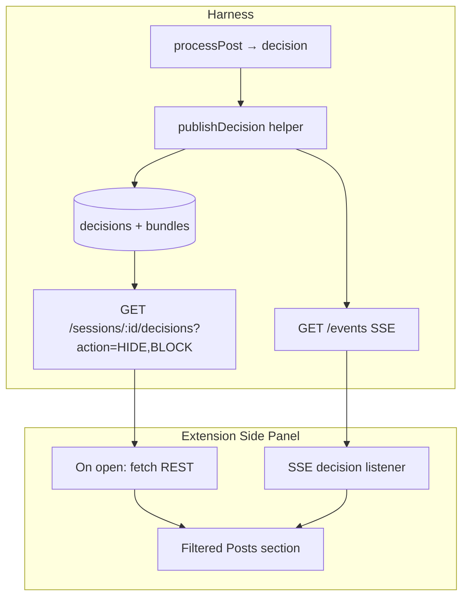

# feat: Hidden Posts Observability in Extension Side Panel

## Summary

Add a **Filtered Posts** section to the Chrome side panel that lists HIDE and BLOCK decisions with author, text snippet, full reason codes, and category — backed by enriched SSE `decision` events and REST hydration on panel open. Timeline BLOCK behavior stays unchanged (posts remain removed from the feed); the panel becomes the operator surface for “what was hidden and why,” including the guardrails demo beat. (see origin: `docs/brainstorms/2026-06-13-signal-density-filter-requirements.md`; extends observability baseline in `docs/plans/2026-06-13-003-feat-observability-plan.md`)

## Problem Frame

The extension already streams decisions to the side panel and dims HIDE posts on the timeline, but the operator cannot answer two demo-critical questions from the current UI:

1. **What** was filtered — rows show truncated bundle IDs, not author or post text (`bundles.normalized_json` is never joined into observability payloads).
2. **Why** — reason codes are truncated to two entries; BLOCK posts disappear from the timeline (`display: none`), so the guardrails beat (“show one blocked post with named reason”) has no visible target on the feed.

Origin requirements R12 and the guardrails segment in the demo script require every rejection to be attributable to a named reason code visible to the operator. The existing “Recent Decisions” feed mixes all actions and is optimized for volume, not narration.

This plan closes the extension-side gap without changing judge-facing timeline semantics for BLOCK.

---

## Requirements

Trace to origin R3, R7, R12, guardrails demo beat (F3), and acceptance example for guardrail blocks. IDs are continuous within this plan.

### Enriched decision payloads

- R1. SSE `decision` events for HIDE and BLOCK include `author_handle` and `text_snippet` (first 120 characters of normalized text, trimmed).
- R2. SSE `decision` events include full `reason_codes` array (no server-side truncation) and `worker` when present.
- R3. `shared/schemas/decision.json` allows nullable `signal_score` and `category` for BLOCK decisions and documents optional observability fields (`author_handle`, `text_snippet`, `worker`).
- R4. All `decision` publish sites — live ingest, tape replay, HITL resolve — use a shared helper so payload shape stays consistent.

### REST hydration for panel history

- R5. `GET /sessions/:sessionId/decisions` accepts optional `?action=HIDE,BLOCK` filter and returns decisions joined with bundle fields (`authorHandle`, `textSnippet`, full `reasonCodes`).
- R6. Panel hydrates the Filtered Posts section on open from R5, then appends live SSE events; deduplicates by `bundle_id` (latest decision wins).

### Extension Filtered Posts UI

- R7. Side panel section **Filtered Posts** lists HIDE and BLOCK only, newest first, capped at 50 rows (separate from the generic Recent Decisions feed).
- R8. Each row shows: action badge, `@author_handle`, text snippet, all reason codes (comma-separated or wrapped), category when present, signal score when present.
- R9. Rows visually distinguish guardrail BLOCK (`GUARDRAIL_*` prefix) from score-based HIDE (`SCORE_BELOW_THRESHOLD` and agent reasons).
- R10. Stats bar adds **Hidden** and **Blocked** counts derived from the filtered feed (not just total decisions).

### Demo reliability

- R11. Replay mode populates Filtered Posts identically to live ingest (same enriched SSE shape).
- R12. After a guardrail BLOCK on demo tape, the operator can point to a panel row showing post text and `GUARDRAIL_*` reason without opening checkpoint drill-down.

---

## Key Technical Decisions

- KTD1: **Sidebar registry for BLOCK, not timeline overlay change.** BLOCK posts stay `display: none` on the timeline so judges see a clean scroll. The guardrails demo beat uses the side panel row (post snippet + named reason), not a visible blocked tweet. Resolves the fork confirmed at plan scoping.
- KTD2: **Enrich SSE at publish time, hydrate via REST on panel open.** Real-time rows get post context immediately without a per-event bundle fetch; REST backfill covers panel-open-mid-session and SSE reconnect gaps. Resolves the data-path fork confirmed at plan scoping.
- KTD3: **Shared `publishDecision(eventBus, sessionId, normalized, decision)` helper** in `harness/routes/sessions.js` (or `harness/lib/publish-decision.js`) builds snake_case SSE payload from normalized bundle + decision object. Ingest router, tape-player, and HITL resolve call the helper.
- KTD4: **`getDecisionsBySession` gains optional action filter + bundle join** in store layer rather than ad-hoc SQL in the route. Join reads `normalized_json` for `author_handle` and text; `textSnippet` computed in store (120 chars).
- KTD5: **Keep Recent Decisions feed unchanged** for pipeline volume observability; Filtered Posts is a dedicated operator-facing rejection log. Avoids breaking existing alarm/checkpoint demo rehearsal.
- KTD6: **Schema relaxation for BLOCK.** `signal_score` and `category` become nullable in `decision.json`; add optional `author_handle`, `text_snippet` strings. Update schema test for valid BLOCK payload.

---

## High-Level Technical Design

**Row lifecycle:** ingest → decision committed → enriched SSE → panel prepends if HIDE/BLOCK → dedupe Map by `bundle_id`. Panel reopen → REST hydrate replaces in-memory filtered list → SSE continues appending.

---

## Scope Boundaries

**In scope:** Decision schema extension, store join + filtered REST, publish helper, side panel Filtered Posts UI, hidden/blocked stats, harness tests, demo checklist update for guardrails beat via panel.

**Out of scope:**
- Changing BLOCK overlay semantics on the timeline (KTD1)
- Overlay decision–DOM reconcile (separate follow-up; overlay still works for HIDE when article is tagged)
- Bulk export, search, or pagination beyond 50-row cap
- Human-readable reason code glossary / i18n

### Deferred to Follow-Up Work

- Click row → expand checkpoint trace (`GET /sessions/:id/checkpoints/:bundleId`) — already planned in observability U4
- Overlay reconcile: apply stored decisions when scraper tags article after late SSE
- SSE reconnect backfill beyond REST hydrate-on-open
- Merge Filtered Posts and Recent Decisions into one tabbed view

---

## Implementation Units

### U1. Extend decision schema and publish helper

**Goal:** Consistent enriched snake_case SSE payloads for all decision sources.

**Requirements:** R1, R2, R3, R4

**Dependencies:** None

**Files:**
- `shared/schemas/decision.json`
- `harness/lib/publish-decision.js` (new)
- `harness/routes/sessions.js`
- `harness/replay/tape-player.js`
- `harness/tests/schemas.test.js`
- `harness/tests/publish-decision.test.js` (new)

**Approach:** Add optional `author_handle`, `text_snippet`; allow `signal_score` and `category` to be null. Helper accepts `{ eventBus, sessionId, normalized, decision }`, builds payload with `text_snippet` from normalized text slice, publishes `decision` event. Replace inline publish blocks in ingest loop, tape-player, and HITL resolve.

**Patterns to follow:** Snake_case SSE fields in `harness/routes/sessions.js`; schema validation in `harness/tests/schemas.test.js`.

**Test scenarios:**
- Valid BLOCK decision with null `signal_score`/`category` and `GUARDRAIL_TOO_SHORT` passes schema validation.
- Helper publishes payload including `author_handle`, `text_snippet`, full `reason_codes`, `worker` for HIDE decision.
- HITL resolve publish includes `text_snippet` when bundle exists; omits gracefully when bundle missing.
- Tape-player uses same helper as ingest (identical payload keys for same post).

**Verification:** `npm test --workspace=harness` passes; manual EventSource listener shows enriched fields on HIDE/BLOCK.

---

### U2. Filtered decisions REST endpoint with bundle join

**Goal:** Panel can hydrate filtered post history on open.

**Requirements:** R5, R6

**Dependencies:** U1

**Files:**
- `harness/db/store.js`
- `harness/routes/sessions.js`
- `harness/tests/store.test.js`
- `harness/tests/sessions-api.test.js` (new or extend)

**Approach:** Add `getDecisionsBySession(sessionId, { actions })` filter via SQL `IN` clause. Join `bundles` on `bundle_id`; parse `normalized_json` for author and text; return camelCase REST shape with `textSnippet`. Route: `GET /:sessionId/decisions?action=HIDE,BLOCK` — default (no query) preserves existing unfiltered behavior for backward compatibility.

**Test scenarios:**
- Session with SHOW, HIDE, BLOCK decisions; `?action=HIDE,BLOCK` returns only filtered actions with `authorHandle` and `textSnippet`.
- BLOCK row includes full `reasonCodes` array (3+ codes when guardrails stack).
- Unknown session returns 404 (match existing session routes).
- Empty filter result returns `[]`.

**Verification:** curl after replay returns enriched HIDE/BLOCK rows with post text.

---

### U3. Side panel Filtered Posts section

**Goal:** Operator-visible rejection log with full “what and why.”

**Requirements:** R7, R8, R9, R10, R11

**Dependencies:** U1, U2

**Files:**
- `extension/sidebar/sidebar.html`
- `extension/sidebar/sidebar.css`
- `extension/sidebar/sidebar.js`
- `extension/background/service-worker.js`

**Approach:** Add `#filtered-list` section and `#hidden-count` / `#blocked-count` stats. On load, message SW `fetch_filtered_decisions` → `GET /sessions/:id/decisions?action=HIDE,BLOCK`. Maintain `filteredByBundle` Map for dedupe. SSE `decision` handler: if action is HIDE or BLOCK, upsert row with full reason codes and enriched fields from payload. CSS: `.action-hide` amber, `.action-block` red; `.reason-guardrail` monospace emphasis for `GUARDRAIL_*` codes.

**Patterns to follow:** Ring buffer / prepend pattern in existing `sidebar.js`; dark theme in `sidebar.css`; SW message types in `service-worker.js`.

**Test scenarios:**
- Test expectation: none — MV3 UI; manual demo checklist.

**Verification:** Live scroll or replay shows Filtered Posts filling with author, snippet, and reasons; guardrail BLOCK row identifiable without timeline post visible.

---

### U4. Demo checklist and integration test

**Goal:** Automated proof of enriched payloads; operator rehearsal script for guardrails beat via panel.

**Requirements:** R12

**Dependencies:** U1, U2

**Files:**
- `harness/tests/filtered-decisions.test.js` (new)
- `docs/demo-checklist.md`

**Approach:** Integration test: create session, ingest guardrail-blocking post (too short) and score-HIDE post via `processPost` or `/ingest`; assert SSE collector receives `author_handle`, `text_snippet`, and `GUARDRAIL_*` on BLOCK. Assert REST filtered endpoint returns both rows with snippets. Update demo checklist: guardrails beat steps reference Filtered Posts row, not timeline BLOCK.

**Test scenarios:**
- Covers guardrails demo beat. **Given** too-short post ingested, **when** SSE `decision` with action BLOCK arrives, **then** payload includes `text_snippet` and `reason_codes` containing `GUARDRAIL_TOO_SHORT`.
- **Given** engagement-bait post scored below threshold, **when** filtered REST queried, **then** row action is HIDE with `SCORE_BELOW_THRESHOLD` and agent reason codes present.
- Demo checklist section documents: open side panel → Filtered Posts → point to BLOCK row during guardrails narration.

**Verification:** Integration test passes in CI; operator completes one replay rehearsal using checklist.

---

## Risks & Dependencies

| Risk | Mitigation |
|------|------------|
| Schema drift between SSE and REST | Single publish helper (KTD3) + store join uses same snippet length constant |
| Panel still empty if harness down | Existing disconnected-state pattern from observability plan; Filtered Posts shows empty with harness-not-running hint |
| Replay duplicate rows | Dedupe by `bundle_id` in panel Map; latest wins |
| Large reason code lists overflow UI | Wrap in sidebar CSS; expand-on-click stretch goal deferred |

**Upstream dependency:** Harness running; session infrastructure from main plan. Does not require observability plan U1 (checkpoint SSE) to land first.

---

## Acceptance Examples

- AE1. **Covers R12, origin guardrails beat.** **Given** demo tape replay with extension side panel open, **when** a post is guardrail-blocked, **then** Filtered Posts shows the post snippet and a `GUARDRAIL_*` reason code the operator can read aloud without opening checkpoints.
- AE2. **Covers R7, R8, origin R12.** **Given** live scroll with mixed SHOW/HIDE/BLOCK outcomes, **when** operator opens side panel mid-session, **then** Filtered Posts hydrates recent HIDE/BLOCK rows with author and full reason codes.
- AE3. **Covers R11, origin R20.** **Given** replay mode, **when** tape processes, **then** Filtered Posts receives the same enriched decision shape as live ingest.
- AE4. **Covers R9.** **Given** one HIDE (score path) and one BLOCK (guardrail path) in session, **when** operator views Filtered Posts, **then** rows are visually distinguishable by action and reason code family.

---

## Sources & Research

- Existing decision SSE publish: `harness/routes/sessions.js`, `harness/replay/tape-player.js`
- Store decisions + bundles: `harness/db/store.js`, `harness/db/schema.sql`
- Side panel patterns: `extension/sidebar/sidebar.js`
- Overlay BLOCK semantics (unchanged): `extension/content/overlay.js`
- Origin demo script guardrails beat: `docs/brainstorms/2026-06-13-signal-density-filter-requirements.md` F3
- Prior observability plan: `docs/plans/2026-06-13-003-feat-observability-plan.md`
- Flow analysis: panel hydration gap, BLOCK timeline invisibility, decision–DOM race (deferred)
