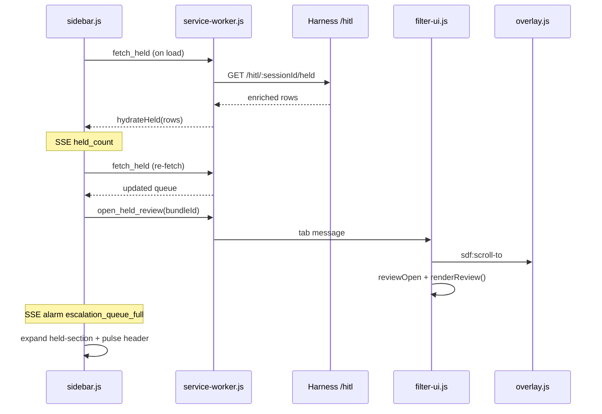

# feat: Held Queue Sidebar Hydration

## Summary

Add a **Held for Review** section to the Chrome side panel that hydrates pending HOLD posts on open, stays in sync via SSE `held_count`, and lets operators jump to the timeline review card on row click. Harness enriches `GET /hitl/:sessionId/held` with bundle author/snippet and HOLD-decision worker; resolve actions remain on the floating HITL panel only. (see origin: `docs/brainstorms/2026-06-13-held-queue-sidebar-requirements.md`)

## Problem Frame

The side panel updates a held-count badge in real time but does not list *which* posts are waiting or *why*. The service worker already implements `fetch_held`, and `filter-ui.js` hydrates held posts on the timeline — but the observability cockpit never consumes the same data. During the HITL demo beat, escalation alarms fire without queue evidence visible in the panel operators already watch.

---

## Requirements

Requirements trace to origin R1–R13 and K1–K4. IDs are continuous within this plan.

### Side panel — Held for Review

- R1. Collapsible **Held for Review** section with header showing pending count.
- R2. Section always visible; body collapsed when count is 0; operator can expand manually.
- R3. On panel load, fetch held queue via service worker `fetch_held` and render rows.
- R4. On SSE `held_count`, update header count and re-fetch queue (same pattern as `filter-ui.js` `refresh()`).
- R5. Each row shows `@author_handle`, text snippet (≤120 chars), agent reason codes, signal score, worker name, and HOLD badge.
- R6. Rows sort newest first; cap at 20 with overflow note when more pending.
- R7. Row click opens timeline review for that bundle: scroll, highlight overlay, floating review card with agent reasons — no resolve buttons in sidebar.
- R8. Resolve in sidebar is out of scope (origin K1).

### Escalation linkage

- R9. On SSE `alarm` with type `escalation_queue_full`, auto-expand Held section and pulse section header.

### Harness REST

- R10. `GET /hitl/:sessionId/held` returns enriched rows: held fields plus `authorHandle`, `textSnippet` (bundle join), `worker` (HOLD decision join).
- R11. Stable shape for live ingest and replay; ordered by `created_at` descending.

### Demo reliability

- R12. Replay mode populates Held section identically to live after panel open + SSE.
- R13. After timeline resolve, held row disappears without panel reload (`held_count` SSE triggers re-fetch).

---

## Key Technical Decisions

- KTD1: **`open_held_review` message, not `reveal_post` alone.** Blocked rows use `reveal_post` for scroll-only navigation. Held rows need scroll plus review card open. New service-worker message forwards to content script; avoids changing blocked-post behavior. (see origin K1, F2)
- KTD2: **Enrich in store, not route.** Mirror `getDecisionsBySession` join pattern in `harness/db/store.js`: `held_posts` LEFT JOIN `bundles` for snippet/author; LEFT JOIN latest HOLD `decisions` row for `worker`. Route stays thin passthrough. (see origin R10, plan 004 KTD4)
- KTD3: **Re-fetch queue on every `held_count` SSE.** Simpler than merge-by-bundle in sidebar; matches `filter-ui.js` refresh after resolve. Acceptable at demo scale (≤20 rows).
- KTD4: **Review target by bundle promotion in `filter-ui.js`.** Today `renderReview()` always shows `heldPosts[0]`. `open_held_review` sets `reviewOpen = true`, promotes clicked `bundleId` to front of `heldPosts` (or selects by id), then calls existing `focusReviewPost` + `renderReview()`.
- KTD5: **Collapsible section mirrors Blocked Posts pattern.** `held-stat` becomes clickable stat controlling `held-section` visibility; reuse `setBlockedVisible` / `aria-expanded` conventions from blocked section. (see origin K2)
- KTD6: **Agent reasons from `held_posts.agentReasons`.** Display as reason codes in row (comma-separated); do not duplicate agent output in a new SSE type for v1. (see origin deferred SSE `held_post`)

---

## High-Level Technical Design

**Data flow:** SQLite `held_posts` + `bundles` + HOLD `decisions` → REST → sidebar list. Resolve stays on timeline → harness `held_count` SSE → sidebar badge + queue refresh.

---

## Scope Boundaries

**In scope:** Store enrichment, held API tests, sidebar section UI/hydrate/SSE sync, `open_held_review` bridge, escalation auto-expand, demo checklist AE6 update.

**Out of scope (see origin):**
- Resolve buttons in sidebar
- Replacing floating HITL panel
- Post-anchored inline HITL cards (ideation #3)
- Per-event SSE `held_post` stream
- Pagination beyond 20-row cap

### Deferred to Follow-Up Work

- Held row click → inline checkpoint trace expand
- Bidirectional timeline badge → sidebar held row highlight (ideation #2)
- Merge held stat click with section expand into single interaction polish

---

## Implementation Units

### U1. Enrich held posts store query and API tests

**Goal:** REST returns author, snippet, worker, and stable ordering for panel hydration.

**Requirements:** R10, R11

**Dependencies:** None

**Files:**
- `harness/db/store.js`
- `harness/lib/publish-decision.js` (reuse `buildTextSnippet` import if not already shared)
- `harness/tests/hitl.test.js`
- `harness/tests/held-api.test.js` (new)

**Approach:** Replace raw `getHeldPosts` SELECT with join query: `held_posts h` LEFT JOIN `bundles b`, LEFT JOIN `decisions d` WHERE `d.action = 'HOLD'` AND matching `bundle_id` (use subquery or join on latest HOLD decision per bundle). Map camelCase: `bundleId`, `agentReasons`, `signalScore`, `category`, `worker`, `authorHandle`, `textSnippet`, `createdAt`. Order `h.created_at DESC`. Export constant `HELD_QUEUE_CAP = 20` used by route or store slice.

**Execution note:** Start with a failing store test asserting enriched fields before changing SQL.

**Patterns to follow:** `getDecisionsBySession` join in `harness/db/store.js`; integration test shape in `harness/tests/filtered-decisions.test.js`.

**Test scenarios:**
- Insert held post with bundle normalized_json containing author and text; `getHeldPosts` returns `authorHandle`, `textSnippet` (120 char cap), and `agentReasons`.
- HOLD decision with `worker: 'heuristic'` appears as `worker` on held row.
- Two held posts return newest-first by `createdAt`.
- HTTP `GET /hitl/:sessionId/held` returns same enriched JSON array (supertest or fetch against `createApp()`).
- Session with zero pending held returns `[]`.

**Verification:** `npm test --workspace=harness` passes; curl held endpoint after borderline HOLD ingest shows author and worker.

---

### U2. Sidebar Held for Review section — markup, hydrate, SSE sync

**Goal:** Panel lists held queue on open and stays current on `held_count`.

**Requirements:** R1, R2, R3, R4, R5, R6, R12, R13

**Dependencies:** U1

**Files:**
- `extension/sidebar/sidebar.html`
- `extension/sidebar/sidebar.css`
- `extension/sidebar/sidebar.js`

**Approach:** Add `held-section` after stats bar (before Blocked Posts): clickable `#held-stat` with `aria-controls="held-section"`, collapsible `#held-section` with `#held-list`. Implement `setHeldVisible`, `normalizeHeldRow`, `renderHeldRow` (extend filtered row template: HOLD badge, agent reasons from array, worker label, confidence). `hydrateHeld(rows)` on load via `fetch_held` parallel to existing alarm/filtered hydrates. On `held_count` message: `setHeldCount` then `fetch_held` → `hydrateHeld`. Auto-collapse body when count returns to 0 unless operator manually expanded (track `heldExpandedByUser` flag). Cap display at 20; show “+N more in queue” footer if API returns more.

**Patterns to follow:** `setBlockedVisible`, `hydrateFiltered`, `renderFilteredRow` in `extension/sidebar/sidebar.js`.

**Test scenarios:**
- Test expectation: none — MV3 UI; covered by manual demo checklist and harness API tests.

**Verification:** Replay demo tape with borderline posts; open panel → expand Held → rows show author, snippet, confidence, worker; resolve on timeline removes row without reload.

---

### U3. Row click → open held review on timeline

**Goal:** Observe-and-jump from sidebar row to floating review card (origin F2, AE2).

**Requirements:** R7, R8

**Dependencies:** U2

**Files:**
- `extension/sidebar/sidebar.js`
- `extension/background/service-worker.js`
- `extension/content/filter-ui.js`

**Approach:** Sidebar held list click → `chrome.runtime.sendMessage({ type: 'open_held_review', bundleId })`. Service worker `openHeldReview(bundleId)`: find active X.com tab, send `{ type: 'open_held_review', bundleId }`. In `filter-ui.js`: handler sets `reviewOpen = true`, ensures `bundleId` is in `heldPosts` (refresh if missing), promotes target post to index 0 or selects by id in `renderReview`, calls `focusReviewPost(bundleId)` and `renderReview()`. Do not add resolve buttons to sidebar.

**Patterns to follow:** Existing `focusReviewPost`, `renderReview`, `revealPost` tab routing in `service-worker.js`.

**Test scenarios:**
- Test expectation: none — cross-context MV3; manual AE2 checklist.

**Verification:** Click held sidebar row → timeline scrolls, review card visible for that post with matching agent reasons; blocked row click still scroll-only via `reveal_post`.

---

### U4. Escalation alarm auto-expand Held section

**Goal:** Link Alarms beat to HITL queue visibility (origin F3, AE3, R9).

**Requirements:** R9

**Dependencies:** U2

**Files:**
- `extension/sidebar/sidebar.js`
- `extension/sidebar/sidebar.css`

**Approach:** In `handleAlarm`, when `data.type === 'escalation_queue_full'`: call `setHeldVisible(true)`, add pulse class to `#held-section` header or `#held-stat` (reuse `@keyframes stat-pulse` from held-count badge). Optionally trigger `fetch_held` if count SSE arrived in same tick.

**Test scenarios:**
- Test expectation: none — manual demo verification.

**Verification:** Replay until third HOLD; alarm appears and Held section expands with pulsing header without operator clicking stat.

---

### U5. Demo checklist and held-queue integration test

**Goal:** Lock REST contract in CI; document AE6 panel-first rehearsal path.

**Requirements:** R12 (automated parity via shared API test)

**Dependencies:** U1

**Files:**
- `harness/tests/held-api.test.js` (extend if split from U1)
- `docs/demo-checklist.md`

**Approach:** Integration test: create session, ingest borderline HOLD via `processPost`, assert `GET /hitl/:id/held` returns enriched row; resolve via store/route, assert count 0 and empty array. Update AE6 steps: side panel Held queue → expand → click row → floating panel resolve → count decrements (panel path alongside existing floating dock path).

**Test scenarios:**
- Covers AE1 / origin R12. **Given** borderline post HOLDed, **when** held REST queried, **then** row includes `authorHandle`, `textSnippet`, `worker`, and `agentReasons`.
- Covers AE4. **Given** resolved held post, **when** held REST queried, **then** returns `[]` and `getHeldCount` is 0.
- Demo checklist documents panel-first HITL narration path.

**Verification:** Integration test passes in CI; operator completes one replay rehearsal using updated AE6.

---

## Risks & Dependencies

| Risk | Mitigation |
|------|------------|
| Review card shows wrong post (always index 0) | KTD4: promote selected bundle before `renderReview()` |
| Held post not in DOM when clicked | `reviewContext` already falls back to REST meta; enriched API reduces empty snippets |
| Duplicate refresh storms on fast replay | Re-fetch only on `held_count` changes, not every decision |
| Worker join ambiguous if multiple HOLD decisions | Join latest HOLD decision per bundle_id by max `decided_at` |

**Upstream dependency:** Harness running; observability baseline (plan 003) SSE `held_count` already wired.

---

## Acceptance Examples

- AE1. **Covers origin AE1.** **Given** demo tape replay with ≥1 HOLD, **when** operator opens side panel and expands Held, **then** rows show author, snippet, confidence, and worker without opening floating dock first.
- AE2. **Covers origin AE2 / F2.** **Given** held row in sidebar, **when** operator clicks row, **then** timeline scrolls and floating review card opens with matching agent reasons.
- AE3. **Covers origin AE3 / F3.** **Given** `escalation_queue_full` during replay, **when** alarm SSE arrives, **then** Held section auto-expands and header pulses.
- AE4. **Covers origin AE4.** **Given** operator resolves Hide on timeline, **when** resolve completes, **then** sidebar queue and badge decrement without panel reload.
- AE5. **Covers origin AE5.** **Given** replay mode, **when** tape processes HOLD posts, **then** enriched held REST shape matches live ingest (U5 integration test).

---

## Sources & Research

- Origin requirements: `docs/brainstorms/2026-06-13-held-queue-sidebar-requirements.md`
- Ideation seed: `docs/ideation/2026-06-13-ui-ux-improvement-ideation.md` (#10)
- Store join pattern: `harness/db/store.js` (`getDecisionsBySession`)
- Sidebar collapsible pattern: `extension/sidebar/sidebar.js` (blocked section)
- Timeline review: `extension/content/filter-ui.js` (`renderReview`, `focusReviewPost`)
- Existing held API: `harness/routes/sessions.js` (`createHitlRouter`)
- Observability held count: `docs/plans/2026-06-13-003-feat-observability-plan.md`
