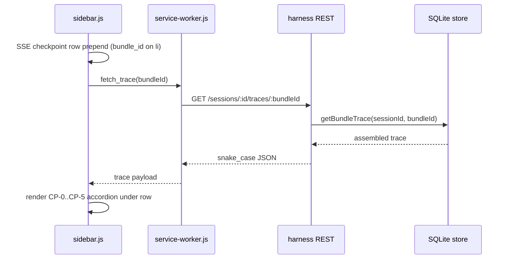

# feat: Bundle Trace Investigation (Checkpoint Drill-Down + Trace API)

## Summary

Add a harness **bundle trace read model** (`GET /sessions/:sessionId/traces/:bundleId`) and wire the side panel checkpoint log so operators can click a row and expand CP-0 through CP-5 inline — closing plan 003 AE2 and ideation #8/#13 without curl. (see origin: ideation #8 Checkpoint Bundle Trace on Click, #13 Bundle Trace Aggregate API)

## Problem Frame

Plans 003/004/005 shipped SSE checkpoints, alarms, filtered posts, and held queue — but the Checkpoints demo beat still stops at scrolling stage codes. Plan 003 U4 promised click-to-drill-down via `GET /sessions/:id/checkpoints/:bundleId`; the route and store query exist, yet `extension/sidebar/sidebar.js` prepends flat rows with no `bundle_id` on the DOM and no fetch handler. Operators cannot show the gate chain judges expect.

Investigating a post today requires multiple mental round-trips (checkpoint REST returns runs only; decision, alarms, and held state live elsewhere). A single trace response compounds every future “explain this post” surface (filtered row expand, alarm forensics, inline stepper) while this plan lands the highest-impact consumer: checkpoint log accordion.

---

## Requirements

Requirements trace to ideation #8 and #13 and plan 003 AE2 / R7 / R10. IDs are continuous within this plan.

### Harness trace read model

- R1. `GET /sessions/:sessionId/traces/:bundleId` returns one JSON object assembling bundle, ordered checkpoint runs, latest decision, bundle-linked alarms, and held state when pending.
- R2. Response uses **snake_case** field names at the REST boundary (match alarms and filtered-decisions routes); nested normalized post follows existing bundle shape.
- R3. Checkpoint runs in the trace are ordered CP-0 → CP-5 (by stage, then insert order); each run includes `stage`, `status`, `reason_code`, `payload` (CP-2 agent output when present), and `created_at`.
- R4. Session scoping: return 404 when session does not exist or bundle belongs to a different session.
- R5. Existing `GET /sessions/:sessionId/checkpoints/:bundleId` remains unchanged for backward compatibility; trace is the preferred aggregate for new UI.

### Extension checkpoint drill-down

- R6. Checkpoint log SSE rows retain `bundle_id` on the list item (`data-bundle-id`) so click targets survive ring-buffer prepends.
- R7. Clicking a checkpoint row toggles an inline accordion under that row showing CP-0…CP-5 from the trace API (pass/fail styling, reason codes on failure).
- R8. CP-2 accordion section expands to show agent output summary (score, category, worker, reasons) when payload includes `agentOutput`.
- R9. Failed stage that stopped the pipeline is visually distinct (reuse checkpoint pass/fail classes from flat log).
- R10. Only one checkpoint row accordion expanded at a time; clicking another row collapses the previous.
- R11. Fetch goes through service worker message `fetch_trace` (same pattern as `fetch_held` / `fetch_alarms`); sidebar does not call harness directly.

### Demo reliability

- R12. Demo checklist includes explicit checkpoint drill-down verification during replay (plan 003 AE2).

---

## Key Technical Decisions

- KTD1: **Aggregate trace API (#13) before sidebar wiring (#8).** One store assembler + route keeps the accordion dumb and gives filtered-post expand / alarm investigation a shared read model later. The per-bundle checkpoint route stays for existing callers.
- KTD2: **Snake_case REST envelope.** Trace response mirrors `GET /sessions/:id/alarms` and enriched decisions — avoids sidebar normalizing two conventions. Store internals stay camelCase; route maps at the boundary.
- KTD3: **`fetch_trace` in service worker.** MV3 side panel uses `chrome.runtime.sendMessage`; SW reads `sessionId` from extension state and calls harness. Matches held-queue and filtered-post hydrate patterns in `extension/background/service-worker.js`.
- KTD4: **Inline accordion, not modal.** Keeps operator in the Checkpoints pillar section during demo narration; matches collapsible section patterns (`setHeldVisible`, blocked posts) already in `sidebar.js`.
- KTD5: **Bundle-linked alarms only in v1 trace.** Include alarms where `bundle_id` matches the trace bundle (e.g. `agent_latency`, `schema_violation`, `confidence_collapse` last bundle). Omit session-wide alarms (`high_block_rate`, `escalation_queue_full`) from trace — those belong in alarm correlation work (#11).
- KTD6: **Latest decision per bundle.** Trace returns the most recent decision row for `bundle_id` (replay may re-run; latest wins). Null when guardrail blocked before decision insert edge cases — accordion still shows checkpoint runs.

---

## High-Level Technical Design

**Trace object shape (REST):**

| Field | Source |
|-------|--------|
| `bundle_id`, `session_id` | `bundles` |
| `normalized` | bundle `normalized_json` |
| `checkpoints[]` | `getCheckpointRuns` ordered by stage |
| `decision` | latest row in `decisions` for bundle |
| `alarms[]` | `getAlarmsBySession` filtered by `bundle_id` |
| `held` | pending `held_posts` row or null |

---

## Scope Boundaries

**In scope:** Store trace assembler, trace REST route + tests, SW `fetch_trace`, sidebar checkpoint click accordion + CSS, demo checklist AE for checkpoint drill-down.

**Out of scope:**
- Filtered Posts / Blocked Posts row expand (same API, separate UI pass)
- Alarm correlation payloads and alarm-row navigation (#11)
- Rolling threshold gauges (#12)
- SSE cursor reconnect backfill (#9)
- CI observability contract gate (#14)
- Timeline overlay or feed↔panel highlight (#2 ideation)

### Deferred to Follow-Up Work

- Filtered Posts row click → same `fetch_trace` accordion (plan 004 deferred item)
- Held row inline trace expand (plan 005 deferred)
- Normalize legacy `GET .../checkpoints/:bundleId` to snake_case (breaking; not needed for demo)
- Bulk session checkpoint export

---

## Implementation Units

### U1. Store bundle trace assembler

**Goal:** Single store method returns all trace parts for a session-scoped bundle.

**Requirements:** R1, R3, R4, R5

**Dependencies:** None

**Files:**
- Create: none
- Modify: `harness/db/store.js`
- Test: `harness/tests/store.test.js`

**Approach:** Add `getBundleTrace(sessionId, bundleId)` that: loads bundle via `getBundle`; returns null if missing or `bundle.sessionId !== sessionId`; loads checkpoint runs and sorts by `CHECKPOINT_STAGES` order (import stage list from `harness/pipeline/checkpoints.js` or duplicate ordered id array); loads latest decision with a new `getLatestDecision(bundleId)` helper; loads session alarms and filters `bundleId === bundle_id`; loads held row via existing held query filtered to bundle or direct `held_posts` lookup. Return camelCase object for route mapping.

**Patterns to follow:** Join enrichment in `getHeldPosts` and `getDecisionsBySession` in `harness/db/store.js`.

**Test scenarios:**
- Happy path: bundle with CP-0..CP-5 runs, decision, and bundle-linked alarm returns all sections populated.
- Wrong session: `getBundleTrace('other-session', bundleId)` returns null.
- Missing bundle: returns null.
- Guardrail-only bundle: checkpoints through failed CP-1, decision BLOCK, no CP-2 payload.
- Held pending: trace includes `held` with agent reasons; resolved held returns null `held`.

**Verification:** Store tests pass; assembler returns deterministic stage order.

---

### U2. Trace REST endpoint

**Goal:** Expose aggregate trace over HTTP with snake_case response and session validation.

**Requirements:** R1, R2, R4, R5

**Dependencies:** U1

**Files:**
- Modify: `harness/routes/sessions.js`
- Create: `harness/tests/trace-api.test.js`

**Approach:** Add `GET /:sessionId/traces/:bundleId` on sessions router before replay route. 404 `{ error: 'not found' }` when session missing or trace null. Map trace to snake_case (`reason_code`, `agent_reasons`, `text_snippet`, etc.) consistent with held and decisions routes. Register route in `harness/server.js` if needed (same mount as sessions).

**Patterns to follow:** `harness/routes/sessions.js` alarms and decisions handlers; `harness/tests/held-api.test.js` HTTP test pattern with `createApp` + ephemeral port.

**Test scenarios:**
- Happy path: `processPost` through pipeline then GET trace returns checkpoints length ≥ 3, decision action present, normalized author_handle present.
- 404 for unknown session id.
- 404 for bundle in different session.
- Response JSON keys are snake_case at top level and on nested decision.

**Verification:** New trace-api tests pass; manual curl against running harness returns expected shape for replayed bundle.

---

### U3. Service worker `fetch_trace` bridge

**Goal:** Side panel can request trace by bundle id through extension messaging.

**Requirements:** R11

**Dependencies:** U2

**Files:**
- Modify: `extension/background/service-worker.js`

**Approach:** Add `fetchTrace(bundleId)` helper: `GET ${HARNESS_URL}/sessions/${sessionId}/traces/${bundleId}` after `ensureSession()`. Handle `case 'fetch_trace': sendResponse(await fetchTrace(message.bundleId))`. Return `{ error }` on non-OK HTTP like existing fetch helpers.

**Patterns to follow:** `fetchHeld()` and `fetchAlarms()` in same file.

**Test scenarios:**
- Test expectation: none — extension messaging; covered by manual demo checklist and harness HTTP tests from U2.

**Verification:** Manual: side panel devtools or SW console shows successful trace fetch when message sent with valid bundle id during replay.

---

### U4. Checkpoint log click accordion

**Goal:** Operators expand CP-0…CP-5 from checkpoint log rows during demo.

**Requirements:** R6, R7, R8, R9, R10, R11

**Dependencies:** U3

**Files:**
- Modify: `extension/sidebar/sidebar.js`
- Modify: `extension/sidebar/sidebar.css`
- Modify: `extension/sidebar/sidebar.html` (only if accordion container markup needs a wrapper — prefer JS-only under existing `#checkpoint-list`)

**Approach:** Change `handleCheckpoint` to set `li.dataset.bundleId = data.bundle_id`, add class `feed-row-clickable`, store minimal row metadata. On list click delegation: if target row has bundle id and is checkpoint row, toggle accordion — fetch via `fetch_trace`, render stage list with pass/fail classes, show reason codes, nested CP-2 agent summary. Track `expandedCheckpointBundleId` to enforce single open accordion. Show loading/error stub on fetch failure.

**Patterns to follow:** Held row click handler and `renderHeldRow`; checkpoint status classes (`checkpointClass`, `sdf-checkpoint-pass/fail`); collapsible section toggle in blocked/held stats.

**Test scenarios:**
- Test expectation: none — UI behavior; manual AE2 verification.

**Verification:** Replay demo tape; click checkpoint row; accordion shows CP-0..CP-5 with CP-1 fail visible on guardrail block post; CP-2 agent output visible on scored post.

---

### U5. Demo checklist — checkpoint drill-down beat

**Goal:** Operators rehearse AE2 explicitly before pitch.

**Requirements:** R12

**Dependencies:** U4

**Files:**
- Modify: `docs/demo-checklist.md`

**Approach:** Add checklist items under AE7 or new **AE2b — Checkpoint drill-down** subsection: side panel checkpoint row click expands stages; guardrail block shows failed CP-1 with reason; scored post shows CP-2 agent summary. Update extension smoke bullet to mention checkpoint accordion.

**Patterns to follow:** AE6 held-queue checklist structure in same file.

**Test scenarios:**
- Test expectation: none — documentation.

**Verification:** Checklist items match observable UI after U4.

---

## Acceptance Examples

- AE1. **Covers plan 003 AE2, R10.** **Given** harness replay has processed at least one post, **when** operator clicks a checkpoint log row in the side panel, **then** an inline accordion shows CP-0 through CP-5 with pass/fail per stage and reason codes on failures.
- AE2. **Covers R8.** **Given** a post scored by the agent (CP-2 passed), **when** operator expands that bundle’s checkpoint trace, **then** CP-2 section shows signal score, category, worker, and agent reasons from stored payload.
- AE3. **Covers R4.** **Given** a bundle id from another session, **when** trace API is requested with wrong session id, **then** HTTP 404 is returned.

---

## System-Wide Impact

**Callbacks / middleware:** Read-only store assembly; no pipeline behavior change.

**Interfaces:** New REST route and SW message type; existing checkpoint route unchanged.

**Tests:** Harness store + HTTP integration; extension manual only.

---

## Risks & Dependencies

| Risk | Mitigation |
|------|------------|
| Fast replay produces many clickable rows | Ring buffer already caps at 20; single accordion limits DOM noise |
| Large CP-2 payload clutters accordion | Show summary fields only; optional “raw JSON” `
` only if needed for demo |
| camelCase vs snake_case drift | U2 tests assert snake_case; sidebar normalizer accepts both during transition |
| Missing stages when pipeline exits early | Render only runs present; label missing later stages as “not reached” or omit |

**Prerequisite:** Harness and extension from plans 003–005 on branch `feat/signal-density-filter`.

---

## Sources & Research

- Ideation #8, #13: `docs/ideation/2026-06-13-ui-ux-improvement-ideation.md`
- Deferred drill-down: `docs/plans/2026-06-13-003-feat-observability-plan.md` U4, AE2
- Filtered-post trace deferral: `docs/plans/2026-06-13-004-feat-hidden-posts-observability-plan.md`
- Existing checkpoint REST: `harness/routes/sessions.js`, `harness/db/store.js` `getCheckpointRuns`
- Sidebar patterns: `extension/sidebar/sidebar.js`, `extension/background/service-worker.js`

External research skipped — codebase has ≥3 direct patterns (held API, filtered decisions, checkpoint store tests).
