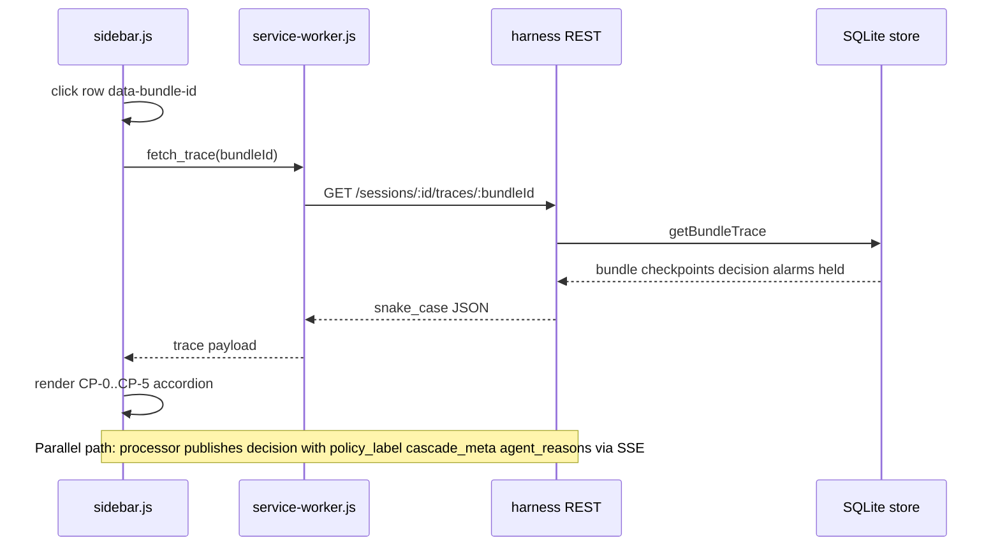

# Explain This Post — Demo Vertical Slice

## Summary

Implement a single demo path so operators click a side-panel row during `demo-v1` replay and show judges the full CP-0..CP-5 gate chain, harness policy (SHOW ≥ 40), scorer provenance, and full agent reasons — plus a rehearsal kit with three anchor bundle IDs. (see origin: `docs/brainstorms/2026-06-13-explain-this-post-demo-slice-requirements.md`)

**Status:** All units U1–U6 implemented; harness tests cover trace HTTP, REST hydrate enrich, and publish path.

---

## Problem Frame

The harness already governed posts through Material Handler, Guardrails, Checkpoints, and Alarms, but the pitch still looked like a dashboard of flat logs. Judges could not verify normalization, gate chains, or threshold policy from the UI. This slice makes governance visible at click-time without terminal or curl.

---

## Requirements

Requirements trace to origin R1–R16 and acceptance examples AE1–AE6.

### Trace investigation

- R1. Session-scoped bundle trace assembles normalized post, CP-0..CP-5 runs, latest decision, bundle-linked alarms, and pending held state.
- R2. Trace returns 404 when session missing or bundle belongs to another session.
- R3. Extension fetches trace via service worker, not direct harness calls from the side panel.
- R4. Checkpoint, filtered HIDE, blocked, and recent decision rows are clickable with stable `data-bundle-id`.
- R5. Click toggles inline CP-0..CP-5 accordion with pass/fail styling and failure reason codes.
- R6. CP-0 accordion shows normalized plain text and content hash (Material Handler beat).
- R7. CP-2 accordion shows agent score, category, and reasons when scored.
- R8. Only one trace accordion expanded at a time.
- R9. Blocked rows: trace on click; secondary control reveals post on timeline.

### Decision explainability

- R10. SHOW/HIDE retain full agent reason list at commit and in published SSE (no two-code truncation).
- R11. Published decisions include human-readable `policy_label` for SHOW/HIDE/BLOCK/HOLD.
- R12. When cascade ran, published decisions include `cascade_meta` (heuristic pre-score, LLM flag, worker, disagreement delta).
- R13. Side panel renders policy and cascade chips on filtered and decision rows without accordion expand.

### Demo rehearsal

- R14. Rehearsal kit documents three anchor bundle IDs on `demo-v1`.
- R15. Kit includes ≤10-minute beat script covering all pillar beats.
- R16. Demo checklist includes trace drill-down and policy chip verification.

---

## Key Technical Decisions

- **KTD1: Aggregate trace read model before UI wiring.** One store assembler plus `GET /sessions/:id/traces/:bundleId` keeps the accordion dumb and compounds future filtered/alarm expand surfaces. (see origin: trace investigation flow F1)

- **KTD2: Enrich at publish, not persist.** `policy_label`, `cascade_meta`, and `agent_reasons` attach in `publish-decision.js` from `commitDecision` + `cascadeResult`. Avoids migration; SSE is authoritative during live/replay demo. Trade-off: REST hydrate on panel reopen lacks chips until U6.

- **KTD3: Service worker `fetch_trace` message.** Matches `fetch_held` / `fetch_filtered_decisions` MV3 pattern; side panel stays thin.

- **KTD4: Single expanded accordion.** `expandedTraceBundleId` + collapse-before-expand satisfies R8 without nested panel state machines.

- **KTD5: Blocked primary = trace, secondary = reveal.** Preserves Guardrails beat (named code in accordion) while keeping AE2 timeline reveal via `trace-reveal-link`.

- **KTD6: Rehearsal kit as deliverable.** Anchor IDs (`demo-bait-0`, `demo-signal-0`, `demo-borderline-0`) are requirements artifacts, not optional docs.

---

## High-Level Technical Design

---

## Scope Boundaries

### Deferred for later (origin)

- In-panel worker rescore
- Harness heartbeat + one-click replay boot
- Held-row inline trace expand (OQ1)
- Alarm-row trace expand
- Timeline inline pipeline stepper

### Deferred to Follow-Up Work

- **U6:** REST hydrate explainability fields + HTTP integration tests for trace route (see U6)

### Outside this slice's identity

- Author history, standalone feed app, Chrome Web Store packaging

---

## Open Questions

### Deferred to planning (resolved)

- **OQ1:** Held-row trace expand → deferred to follow-on slice (plan 006 lineage).
- **OQ2:** Cascade chip format → fixed demo strings (`H:N`, `H:N → L:M ΔD`); not user-configurable in v1.

---

## Risks and Dependencies

| Risk | Mitigation |
|------|------------|
| Panel reopen mid-replay loses chips (REST hydrate gap) | Keep side panel open during demo; run U6 if rehearsing with reload |
| AE4 cascade chip needs LLM path | Pre-run `npm run replay -- --tape demo-v1 --from CP-3 --agent llm` before pitch |
| Heuristic-only replay hides LLM disagreement | Narrate cascade from pre-staged terminal output or LLM replay |
| Fast checkpoint SSE fills list before click | Rehearsal kit points to anchor bundle IDs, not hunt-by-scroll |

**Dependencies:** Plans 003–005 (SSE, filtered posts, held queue), `tapes/demo-v1`, extension replay hotkey.

---

## Implementation Units

### U1. Harness bundle trace read model

**Goal:** Assemble and expose session-scoped bundle trace for extension accordion.

**Requirements:** R1, R2

**Dependencies:** None

**Files:**
- Modify: `harness/db/store.js`
- Create: `harness/lib/trace-api.js`
- Modify: `harness/routes/sessions.js`
- Create: `harness/tests/trace-api.test.js`

**Approach:** `getBundleTrace(sessionId, bundleId)` joins bundle, checkpoint runs, latest decision, filtered alarms, pending held row. `mapTraceToRest` orders CP-0..CP-5 via `orderCheckpointRuns`. Route returns 404 when trace null.

**Patterns to follow:** snake_case REST boundary like `GET /sessions/:id/alarms`; camelCase store internals.

**Test scenarios:**
- Covers AE1 foundation. Given replay session with `demo-bait-0`, when `getBundleTrace` called, then checkpoints include CP-1 fail and decision BLOCK.
- Given bundle in different session, when trace fetched, then null/404.
- Given scored post, when trace mapped, then CP-2 payload includes agentOutput.

**Verification:** `npm test --workspace=harness -- tests/trace-api.test.js` passes.

---

### U2. Enriched decision publish path

**Goal:** Emit full agent reasons, policy labels, and cascade metadata on every decision SSE event.

**Requirements:** R10, R11, R12

**Dependencies:** None (parallel with U1)

**Files:**
- Modify: `harness/pipeline/decision.js`
- Create: `harness/lib/cascade-meta.js`
- Modify: `harness/lib/publish-decision.js`
- Modify: `harness/replay/tape-player.js`
- Modify: `harness/routes/sessions.js` (ingest publish path)
- Modify: `shared/schemas/decision.json`
- Modify: `harness/tests/publish-decision.test.js`, `harness/tests/decision.test.js`

**Approach:** Remove `reasons.slice(0, 2)` for SHOW/HIDE in `commitDecision`. Add `buildPolicyLabel` and `buildCascadeMeta`. Pass `cascadeResult` and `agentReasons` into `publishDecision` from processor and tape replay.

**Test scenarios:**
- Covers AE3, AE4 payload shape. Given HIDE score 39, when payload built, then `policy_label` references threshold 40.
- Given cascade with LLM disagreement, when payload built, then `cascade_meta.disagreement_delta` present.
- Given SHOW decision, when payload validated against schema, then valid with full `agent_reasons`.

**Verification:** `npm test --workspace=harness -- tests/publish-decision.test.js` passes; schema validation test green.

---

### U3. Extension trace fetch and accordion UI

**Goal:** Click side-panel rows to expand CP-0..CP-5 inline trace.

**Requirements:** R3, R4, R5, R6, R7, R8, R9

**Dependencies:** U1

**Files:**
- Modify: `extension/background/service-worker.js`
- Modify: `extension/sidebar/sidebar.js`
- Modify: `extension/sidebar/sidebar.css`

**Approach:** Add `fetch_trace` message handler. `prependItem` accepts `data-bundle-id`. `toggleTraceAccordion` fetches trace and renders stages; `collapseTraceAccordions` enforces single expand. Blocked list adds `trace-reveal-link` footer.

**Test scenarios:**
- Covers AE1, AE2, AE6. Manual: click checkpoint for `demo-signal-0` → CP-0 text + CP-5 SHOW.
- Manual: click `demo-bait-0` blocked row → CP-1 `GUARDRAIL_*`; reveal link scrolls timeline.
- Manual: expand one row, click another → only one accordion visible.

**Verification:** Manual demo checklist AE3b; replay `demo-v1` with side panel open.

---

### U4. Side panel explainability chips

**Goal:** Render policy and cascade chips on filtered and decision rows from SSE.

**Requirements:** R13

**Dependencies:** U2, U3 (shared sidebar)

**Files:**
- Modify: `extension/sidebar/sidebar.js`
- Modify: `extension/sidebar/sidebar.css`

**Approach:** `normalizeFilteredRow` carries `policyLabel`, `cascadeMeta`, `agentReasons`. `renderExplainChips` + `renderReasonBlock` on filtered/decision rows. `formatCascadeChip` mirrors harness helper.

**Test scenarios:**
- Covers AE3. Given HIDE row via SSE with score 39, when row renders, then policy chip visible and agent reasons not truncated to two codes.
- Covers AE4. Given row with `cascade_meta.llm_invoked`, when row renders, then cascade chip shows heuristic→LLM path.

**Verification:** Manual on replay; filtered list shows chips without accordion expand.

---

### U5. Demo rehearsal kit and checklist

**Goal:** Scripted operator path with three anchors and timed beats.

**Requirements:** R14, R15, R16

**Dependencies:** U3, U4 (operator verifies against UI)

**Files:**
- Create: `docs/demo-rehearsal-kit.md`
- Modify: `docs/demo-checklist.md`

**Approach:** Document anchors `demo-bait-0`, `demo-signal-0`, `demo-borderline-0` with expected trace outcomes. Add 10-minute beat script and AE3b checklist items for trace drill-down + policy chips.

**Test scenarios:**
- Covers AE5. Given operator follows kit on replay, when timed, then script completes ≤10 min without hunting posts.

**Verification:** Two consecutive replay rehearsals with identical anchor outcomes (origin success criteria).

---

### U6. Hardening — REST hydrate and HTTP trace tests (optional)

**Goal:** Close hydrate gap and add HTTP-level R2 coverage.

**Requirements:** R2 (HTTP layer), R13 (hydrate parity)

**Dependencies:** U1, U2, U4

**Files:**
- Modify: `harness/db/store.js` or `harness/routes/sessions.js` (decisions REST enrich)
- Modify: `harness/tests/sessions-api.test.js` or `harness/tests/trace-api.test.js`
- Modify: `extension/sidebar/sidebar.js` (hydrate path uses enriched fields)

**Approach:** Either persist explainability fields on decision insert or recompute `policy_label` from stored score/action at REST boundary. Add HTTP tests for trace 404 cases.

**Test scenarios:**
- Given side panel closed and reopened mid-replay, when filtered decisions hydrate, then policy chips still visible.
- Given missing session id, when GET trace, then HTTP 404.

**Verification:** `npm test` green; manual panel reload during replay shows chips.

---

## Build Sequence

| Phase | Units | Milestone |
|-------|-------|-----------|
| 1 — Harness core | U1, U2 | Trace API + enriched SSE |
| 2 — Extension UI | U3, U4 | Click-to-explain in side panel |
| 3 — Demo ops | U5 | Rehearsal kit + checklist |
| 4 — Hardening (optional) | U6 | Hydrate + HTTP tests |

---

## Acceptance Examples (verification matrix)

| AE | Requirements | Verify via |
|----|--------------|------------|
| AE1 | R1,R5,R6,R7 | Click `demo-signal-0` checkpoint/filtered row on replay |
| AE2 | R1,R5,R9 | Click `demo-bait-0` blocked row + optional reveal |
| AE3 | R10,R11,R13 | HIDE filtered row shows policy chip + full reasons (SSE) |
| AE4 | R12,R13 | LLM replay row shows cascade chip with delta |
| AE5 | R14,R15,R16 | Timed rehearsal kit run |
| AE6 | R8 | Two-row accordion collapse behavior |

---

## Sources

- Origin requirements: `docs/brainstorms/2026-06-13-explain-this-post-demo-slice-requirements.md`
- Ideation: `docs/ideation/2026-06-13-hackathon-demo-winning-ideation.md`
- Operator script: `docs/demo-rehearsal-kit.md`
- Parent hackathon reqs: `docs/brainstorms/2026-06-13-signal-density-filter-requirements.md`
