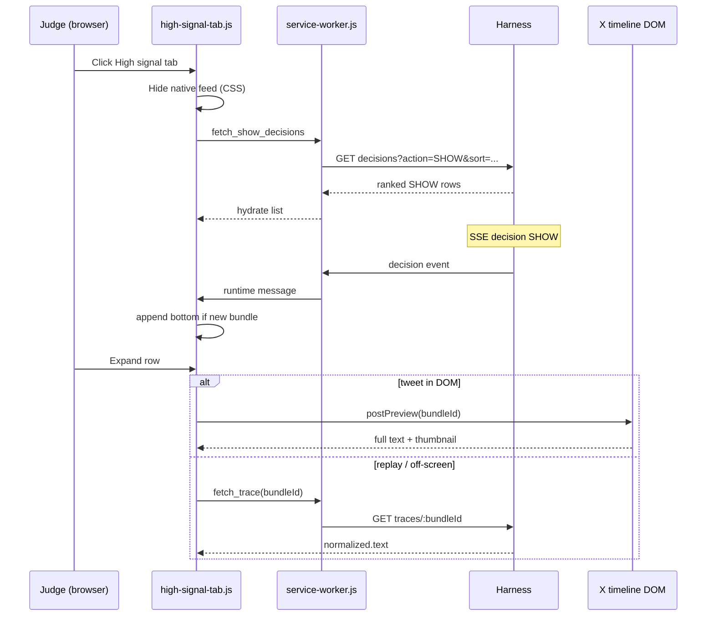

# feat: High Signal Tab

## Summary

Inject a **High signal** tab left of **For you** on X home. When active, replace the native timeline with an extension-built list of **SHOW** posts sorted by **signal score descending** on initial load. Judges expand rows inline (full text, score, reason codes, optional media thumbnail). New SHOW decisions append to the bottom without re-sorting. Harness gains a score-sorted SHOW decisions query; the extension adds a content-script feed module and service-worker bridge. (see origin: `docs/brainstorms/2026-06-13-high-signal-tab-requirements.md`)

## Problem Frame

Scores are visible in operator tooling but not in a judge-facing ranked feed. The demo’s “signal density” story today depends on filtering **For you**, not on a dedicated highest-signal-first reading surface. This plan delivers the tab spec from brainstorm F1–F4 and acceptance examples AE1–AE8.

---

## Requirements

Requirements trace to origin R1–R21, K1–K10, and success criteria. IDs are continuous within this plan.

### Tab navigation

- R1. Inject **High signal** tab immediately left of native **For you** on X home (`/home` or equivalent primary feed route).
- R2. **High signal** and **For you** are mutually exclusive primary-column views.
- R3. **High signal** hides native timeline content and shows the extension list.
- R4. **For you** hides the extension list and restores native timeline with existing overlays.
- R5. Active tab is visually distinct; selection persists for the page session via `chrome.storage.session`.

### Feed list

- R6. List includes only latest committed **SHOW** decisions for the current session (dedupe by `bundleId`, latest wins).
- R7. Initial hydrate sorts by **signal score descending**; null scores sort last; tie-break `decidedAt` descending then `bundleId` ascending.
- R8. Collapsed rows show author handle or display name, text snippet, signal score, and SHOW indicator.
- R9. HOLD, HIDE, and BLOCK never appear.
- R10. Empty state when hydrate succeeds with zero SHOW rows.

### Card interaction

- R11. Tap collapsed row to expand inline; tap again or use collapse affordance to collapse.
- R12. Expanded panel shows full post text, signal score, and agent/policy reason codes — read-only, no resolve actions.
- R13. Full text prefers live DOM tweet text when article exists; otherwise lazy `fetch_trace` for `normalized.text`; if only snippet available, show partial indicator.
- R14. Expanded panel shows image/media thumbnail from DOM when present; no inline video player.
- R15. Card interaction does not switch to **For you** or scroll the native timeline.

### Live updates

- R16. SSE `decision` with SHOW for a new `bundleId` appends row at bottom.
- R17. Append does not reorder existing rows.
- R18. Non-SHOW decision for a listed `bundleId` removes the row (including expanded state).

### Reliability

- R19. Replay mode uses the same hydrate + SSE append/remove behavior as live.
- R20. Failed initial hydrate or unavailable extension runtime shows **disconnected** state, not empty success.
- R21. On `mode` broadcast (live ↔ replay), clear list and rehydrate.

---

## Key Technical Decisions

- **KTD1: Server-side score sort on hydrate.** Extend `getDecisionsBySession` with optional `sort` (`signal_score:desc,decided_at:desc`) and `latestOnly: true`. When `action=SHOW`, return the latest decision per `bundleId` **only if that latest action is SHOW** (so SHOW→HIDE removes the bundle from results). Route: `GET /sessions/:id/decisions?action=SHOW&sort=signal_score:desc,decided_at:desc&latest=true`. Client append-bottom handles live drift per origin K5. (see origin R7, ideation harness sort)
- **KTD2: CSS-hide native timeline, keep DOM.** Set native primary-column feed wrapper to hidden (not detached) so DOM-first expand and scraper articles remain queryable when user toggled from **For you**. (see flow analysis Q5)
- **KTD3: Lazy trace fetch on expand only.** Decisions hydrate returns 120-char `textSnippet` for list rows. On expand when DOM text absent, call existing `fetch_trace` and read `normalized.text`. Cache per `bundleId` in module memory. (see origin K9, AE8)
- **KTD4: Reason codes from decision row + trace fallback.** List and expand show `reasonCodes` from decision payload. For agent prose, prefer SSE-cached `agent_reasons` when present; on hydrate-only rows filter policy codes (`SCORE_ABOVE_THRESHOLD`) for display. Optional trace CP-2 read deferred unless replay expand still thin after filter. (see origin R12)
- **KTD5: Latest-wins Map + ordered id list.** Maintain `showByBundle` Map and `showOrder[]` array. Hydrate rebuilds both; SSE SHOW upserts Map and appends to `showOrder` only if new bundle; downgrade deletes from both. (see origin R18, plan 004 filtered-panel pattern)
- **KTD6: Extract shared `postPreview` helper.** Move DOM scrape from `filter-ui.js` into `extension/content/post-preview.js` (text, handle, displayName, media thumbnail selector). Import from filter-ui and high-signal to avoid third copy. (see repo research)
- **KTD7: Home-only tab injection with resilient selectors.** Inject when pathname is `/home` (or `/`) and primary tablist exists; use MutationObserver retry like overlay review-actions. Hide injected tab when navigating away. (see origin R1, fragility risk)
- **KTD8: Cross-surface event parity.** High signal listens to `chrome.runtime.onMessage` types: `decision`, `mode`, and content `sdf:override` (operator restore adds SHOW locally without SSE). (see flow analysis gap #6)
- **KTD9: Fix pre-existing `fetch_held` handler.** `service-worker.js` calls undefined `fetchHeld()` — wire to `GET /hitl/:sessionId/held` (same as sidebar) while adding `fetch_show_decisions`. (see repo research gap)
- **KTD10: Disconnected detection.** Initial hydrate `fetch_show_decisions` rejection → disconnected UI. Successful empty array → empty UI. Do not infer harness health from SSE alone in v1.

---

## High-Level Technical Design

**State machine (feed module):**

| State | Entry | Exit |
|-------|-------|------|
| `for_you` | Default / user clicks For you | User clicks High signal |
| `high_signal_loading` | Tab click | Hydrate success or failure |
| `high_signal_ready` | Hydrate success | Tab switch, mode change, teardown |
| `high_signal_empty` | Zero SHOW rows | New SHOW SSE |
| `high_signal_disconnected` | Hydrate failure | Retry on tab re-click or harness recovery |

---

## Scope Boundaries

**In scope:** Harness sort + latest-only query, SW bridge, tab injection, feed list, inline expand, empty/disconnected states, replay parity, `post-preview` extract, `fetch_held` fix.

**Deferred to Follow-Up Work:**
- In-tab sort modes (Shoreline, Fresh, asc toggle) — origin deferred
- Sidebar score sort as primary story — origin deferred
- Harness connection badge broadcast to all surfaces — only High signal disconnected UI in v1
- List virtualization / cap beyond soft MAX_SHOW note — origin deferred to planning
- Inline video playback — origin K10 out of scope

**Carried from origin (non-goals):** Timeline DOM reorder by score; HOLD/HIDE in tab; jump-to-For-you on tap; resolve actions in expand panel.

---

## System-Wide Impact

- **Extension content scripts:** New module in manifest load order after `filter-ui.js` (or before — must register `sdfRuntime.onInvalidate` teardown).
- **Service worker:** New message type; bugfix on `fetch_held`.
- **Harness store/routes:** Sort and latest-only options on existing decisions endpoint — replay and sidebar consumers unaffected when params omitted.
- **Demo checklist:** Add manual smoke steps for High signal tab (not a new markdown doc unless user requests).

---

## Risks & Dependencies

| Risk | Mitigation |
|------|------------|
| X tab bar DOM changes | Resilient selectors + observer retry; document selector in plan U3 verification |
| HITL resolve SHOW with null `signalScore` | Nulls-last sort; display `—`; optional follow-up to preserve held score in harness |
| Duplicate decisions after replay re-emit | `latestOnly` on hydrate + Map dedupe on SSE |
| `fetchHeld()` runtime error breaks held refresh | Fix in U2 before demo |
| Full text latency on expand | Lazy trace fetch; show loading skeleton in expand panel |

**Dependencies:** Existing SSE `decision` payload (`signal_score`, `reason_codes`, optional `agent_reasons`, `author_handle`, `text_snippet`); `GET /sessions/:id/traces/:bundleId`; replay tape with SHOW decisions.

---

## Implementation Units

### U1. Harness SHOW decisions query with score sort

**Goal:** Authoritative initial hydrate ordered by score for replay/live parity.

**Requirements:** R6, R7, R19

**Dependencies:** None

**Files:**
- `harness/db/store.js`
- `harness/routes/sessions.js`
- `harness/tests/high-signal-decisions.test.js` (create)

**Approach:** Add optional `sort` string parser (`field:dir` pairs) and `latestOnly` flag to `getDecisionsBySession`. For `latestOnly`, subquery or window function picking max `decided_at` per `bundle_id`. Default behavior unchanged when params absent. `nulls last` on `signal_score`.

**Patterns to follow:** `harness/tests/filtered-decisions.test.js`, plan 004 store enrichment join.

**Test scenarios:**
- Covers AE1. GET `action=SHOW&sort=signal_score:desc` returns scores 91, 72, 55 order
- SHOW filter excludes HOLD/HIDE/BLOCK — Covers AE2
- Two decisions same bundle (SHOW then HIDE): `latestOnly=true` with `action=SHOW` excludes bundle — Covers AE4 hydrate path
- Null `signal_score` sorts after numeric scores
- Tied scores break by `decided_at` desc

**Verification:** `npm test` passes new file; manual curl against running harness returns sorted SHOW array.

---

### U2. Service worker bridge + fetch_held fix

**Goal:** Content scripts can hydrate SHOW list and existing held fetch stops throwing.

**Requirements:** R6, R20

**Dependencies:** U1

**Files:**
- `extension/background/service-worker.js`

**Approach:** Add `fetchShowDecisions()` calling `GET /sessions/${sessionId}/decisions?action=SHOW&sort=signal_score:desc,decided_at:desc&latest=true`. Message type `fetch_show_decisions`. Fix `fetch_held` case to call `GET /hitl/${sessionId}/held` (mirror sidebar) instead of undefined `fetchHeld()`.

**Test scenarios:**
- Integration via harness tests only (no extension test runner)
- Manual: sidebar `fetch_held` and new `fetch_show_decisions` both return JSON from SW devtools

**Verification:** No ReferenceError on `fetch_held`; show endpoint returns sorted array in network tab.

---

### U3. Shared post preview helper

**Goal:** DOM-first text and media thumbnail scrape reused by filter-ui and High signal.

**Requirements:** R13, R14

**Dependencies:** None (can parallel U1)

**Files:**
- `extension/content/post-preview.js` (create)
- `extension/content/filter-ui.js` (refactor import)
- `extension/manifest.json`

**Approach:** Export functions: `getPostPreview(bundleId)` → `{ text, handle, displayName, inFeed, mediaUrl? }`. Media: first `[data-testid="tweetPhoto"] img` src or video poster. Refactor filter-ui to use helper without behavior change.

**Test scenarios:**
- Manual on live X: filter-ui review card still resolves author/snippet
- Manual: preview returns thumbnail URL for image tweet

**Verification:** filter-ui held/blocked flows unchanged; helper loaded in manifest before filter-ui and high-signal scripts.

---

### U4. High signal tab, column swap, and feed list

**Goal:** Judge-facing ranked SHOW list with append/remove SSE behavior.

**Requirements:** R1–R5, R6–R10, R16–R18, R19, R21

**Dependencies:** U2, U3

**Files:**
- `extension/content/high-signal-tab.js` (create)
- `extension/shared/high-signal.css` (create)
- `extension/manifest.json`
- `extension/shared/inject-styles.js` (if needed for new CSS bundle)

**Approach:**
- Detect home; inject tab button left of For You tab (discover via `[role="tablist"]` + tab text match).
- On High signal select: hide native timeline section inside `primaryColumn`, mount `#sdf-high-signal-root` list container.
- `hydrate()`: fetch_show_decisions → build Map + order array → render collapsed rows.
- SSE handler: SHOW new bundle → append bottom; SHOW update same bundle → update row in place without reorder; non-SHOW → remove.
- `mode` message → clear + rehydrate.
- Listen `sdf:override` CustomEvent: SHOW adds/updates row at bottom; HIDE removes.
- Empty and disconnected templates with distinct copy.
- Soft cap: display first 100 rows with “+N more” note if API returns more (defer server cap).

**Patterns to follow:** `extension/sidebar/sidebar.js` filtered Map + render; `extension/content/filter-ui.js` drawer cards and `escapeHtml`; design tokens from `extension/shared/tokens.css`.

**Test scenarios:**
- Covers AE1, AE2, AE3, AE4, AE5, AE6 — manual demo checklist
- Covers AE3 append: existing order unchanged when higher score arrives
- Replay Alt+Shift+R: list rebuilds without duplicate bundle rows
- Tab switch For you ↔ High signal preserves overlay decisions on For you return

**Verification:** Judge can open tab and see score-desc list without side panel; empty vs disconnected visually distinct.

---

### U5. Inline expand panel

**Goal:** Read-only expand with DOM-first text, trace fallback, reason codes, thumbnail.

**Requirements:** R11–R15, R12–R14

**Dependencies:** U3, U4

**Files:**
- `extension/content/high-signal-tab.js`
- `extension/shared/high-signal.css`

**Approach:** On row click toggle expanded class. Load content async: (1) `getPostPreview`, (2) if no/incomplete text `fetch_trace`, (3) render score, formatted reason list, optional `` thumbnail. Single expanded row at a time (collapse others). No action buttons.

**Test scenarios:**
- Covers AE7. Live DOM expand shows full text, score, codes, thumbnail when image tweet
- Covers AE8. Replay expand uses trace text when DOM absent
- Partial snippet shows “partial content” badge when trace unavailable
- Expanded row removed on downgrade without scroll jump — Covers AE4 edge

**Verification:** Expand matches brainstorm K8 read-only; no navigation to For you.

---

## Open Questions

**Deferred to Implementation:**
- Exact X tab selector strings (discover on live DOM during U4)
- Collapsed snippet length (truncate at 120 to match harness snippet)
- Whether to preserve held `signalScore` on HITL resolve in harness (optional polish if null scores appear in demo tape)

**Resolve Before Implementation:** None.

---

## Sources & Research

- Origin: `docs/brainstorms/2026-06-13-high-signal-tab-requirements.md`
- Ideation: `docs/ideation/2026-06-13-sort-posts-by-score-ideation.md`
- Patterns: `docs/plans/2026-06-13-004-feat-hidden-posts-observability-plan.md`, `docs/plans/2026-06-13-003-feat-observability-plan.md`, `docs/plans/2026-06-13-signal-density-filter-plan.md`
- Trace API: `harness/lib/trace-api.js`, `harness/tests/trace-api.test.js`
