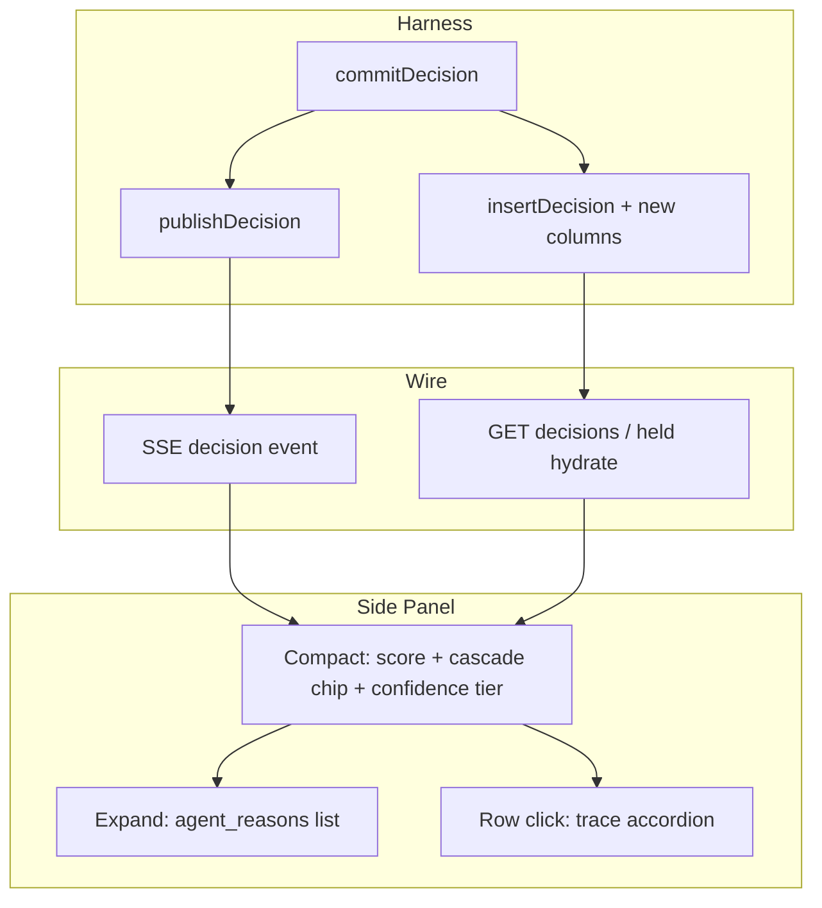

# feat: Post Score Explainability — Phase A

## Summary

Close the gap between live SSE explainability and durable panel hydrate: persist full agent reasons, cascade provenance, confidence, and escalate on every scored decision; publish the same fields on SSE; render compact cascade and confidence disclosure on side panel rows with full agent reasons behind expand. (see origin: Phase A brainstorm R1–R21)

## Problem Frame

Plan 007 shipped trace drill-down, `policy_label`, partial `cascade_meta`, and inline agent reasons on Filtered Posts — but explainability is still forward-only on the SSE path. Panel reopen loses grading context; agent strings remain merged into harness `reason_codes`; confidence and gray-band status never surface; Held and Recent Decisions lack parity with Filtered Posts chips. Phase A makes "why this score?" answerable from compact row + expand without curl or logs.

---

## Requirements

Requirements trace to origin R1–R21, flows F1–F3, acceptance examples AE1–AE6.

### Harness — commit and publish

- **R1.** SHOW/HIDE/HOLD commits retain full agent `reasons` without truncation.
- **R2.** Harness `reason_codes` contain policy codes only — no agent reason strings spliced in.
- **R3.** Published decision events include `agent_reasons`, `confidence`, and `escalate` when agent scoring ran.
- **R4.** Published decision events include complete `cascade_meta` with `branch_trigger` covering heuristic-only, gray-band, escalate, disagreement, force-LLM, and LLM-fallback paths.
- **R5.** BLOCK guardrail decisions omit agent scoring fields.
- **R6.** Persist explainability fields on `decisions` insert so REST hydrate matches live SSE.
- **R7.** Ingest, tape replay, and HITL resolve all call the shared publish helper with the same enriched shape.

### Side panel — disclosure

- **R8.** Recent Decisions, Filtered Posts, and Held for Review rows show compact score + cascade chip + confidence tier (+ gray-band badge when applicable).
- **R9.** Full `agent_reasons` list appears only on explicit expand — not inline in compact row.
- **R10.** Harness `reason_codes` stay visible as policy context, separate from agent reasons in expand.
- **R11.** One expanded reason panel per list section at a time; BLOCK rows hide agent-reason expand.
- **R12.** Panel hydrate on open renders the same compact/expand behavior as live SSE rows.

---

## Key Technical Decisions

- **KTD1: Persist explainability on decisions — supersedes plan 007 KTD2 for this slice.** Plan 007 enriched at publish only to avoid migration. Phase A requires REST hydrate parity (origin R8, R21). Add JSON columns on `decisions` for `agent_reasons`, `confidence`, `escalate`, and `cascade_meta`. Single write path in `insertDecision`.

- **KTD2: Policy-only `reason_codes`.** Stop spreading agent reason strings into `reasonCodes` in `commitDecision`. SSE `reason_codes` and stored JSON carry harness policy only; `agent_reasons` is the grading channel. UI already partially separates via `renderReasonBlock` — align data layer with origin K3.

- **KTD3: Split trace click from reason expand.** Plan 007 binds row click to trace accordion. Phase A adds a dedicated expand control (chevron or "Reasons" toggle) for agent reasons. Row click continues to open gate-chain trace; expand control toggles reason stack only. Avoids R11/R18 conflict with trace accordion.

- **KTD4: Shared grading row renderer.** One sidebar helper builds compact + expand HTML for Filtered, Recent, and Held lists. Normalizes snake_case/camelCase from SSE and REST. Reuses existing `formatCascadeChip` / `renderExplainChips` patterns.

- **KTD5: REST wire shape via route mapper.** Decisions REST returns explainability fields with the same semantics as SSE. Add a route-layer mapper (pattern from trace REST) rather than breaking existing camelCase store internals abruptly. Sidebar normalizers accept both during transition.

- **KTD6: Held cascade/confidence via decision join.** Extend held REST store query to join latest HOLD decision for worker + explainability fields rather than duplicating columns on `held_posts`.

---

## High-Level Technical Design

---

## Scope Boundaries

**In scope:** Harness persistence + publish completion; side panel compact/expand UX on three lists; REST hydrate parity; tests and demo checklist updates.

**Deferred (Phase B+ per origin):** Score ledger, harness commit explainer fork, threshold ruler, LLM diff panel, timeline overlay.

**Deferred to follow-up work:** Recent Decisions full-session hydrate if no fetch path exists today — add `fetch_recent_decisions` or reuse decisions endpoint with cap; trace accordion remains complementary, not primary explain surface.

**Outside scope:** Post-hoc LLM narrative summaries; OpenTelemetry export.

---

## System-Wide Impact

- **SSE payload:** Adds `confidence`, `escalate`; may shrink `reason_codes` arrays when agent strings removed.
- **SQLite schema:** New nullable columns on `decisions`; existing sessions degrade gracefully (empty chips when columns null).
- **Extension:** Sidebar CSS for confidence tiers and expand affordance; no timeline overlay changes.
- **Demo tapes:** Older JSONL without new DB columns still run; hydrate shows policy chips only where data exists.

---

## Risks & Dependencies

| Risk | Mitigation |
|------|------------|
| Trace click vs reason expand confusion | KTD3: separate controls; title attributes on each |
| REST/SSE drift | Single `buildDecisionEventPayload`; mapper tests |
| Plan 007 inline reasons conflict with expand-only | Remove inline agent block from compact row in U4 |
| Held rows missing cascade until join | U3 extends store join; test held API |

**Depends on:** Existing `publishDecision`, `buildCascadeMeta`, trace API (unchanged), plan 004 filtered-posts hydrate pattern.

---

## Implementation Units

### U1. Policy-only commit and cascade meta completion

**Goal:** Align `commitDecision` with origin R2; complete cascade branch triggers for origin R4–R5.

**Requirements:** R1, R2, R4

**Dependencies:** None

**Files:**
- `harness/pipeline/decision.js`
- `harness/lib/cascade-meta.js`
- `harness/tests/decision.test.js`
- `harness/tests/trace-api.test.js` (cascade meta tests)

**Approach:** Remove agent reason spread from SHOW/HIDE `reasonCodes`. Set `branch_trigger: heuristic_only` when LLM not invoked; add `llm_fallback` when cascade output carries fallback flag; include final signal score on LLM path for chip formatting.

**Patterns to follow:** Existing HOLD path already keeps `agentReasons` separate.

**Test scenarios:**
- SHOW at 72 → `reasonCodes` is `['SCORE_ABOVE_THRESHOLD']` only; `agentReasons` length 3 preserved
- HIDE at 38 → same separation
- Heuristic-only cascade → `branch_trigger: heuristic_only`
- LLM error fallback → `branch_trigger: llm_fallback`
- Disagreement delta ≥ 15 present on meta

**Verification:** Decision unit tests pass; no agent strings in stored `reason_codes_json` for new commits.

---

### U2. Persist explainability on decisions

**Goal:** Store grading context for REST hydrate (origin R6, R8).

**Requirements:** R6, R7

**Dependencies:** U1

**Files:**
- `harness/db/schema.sql`
- `harness/db/store.js` (`insertDecision`, `getDecisionsBySession`, `getLatestDecision` if used by trace)
- `harness/pipeline/processor.js` (pass fields into insert)
- `shared/schemas/decision.json` (add `confidence`, `escalate`)
- `harness/tests/store.test.js`
- `harness/tests/filtered-decisions.test.js`

**Approach:** Add columns: `agent_reasons_json`, `confidence REAL`, `escalate INTEGER`, `cascade_meta_json`. Thread from `agentOutput` + `cascadeResult` at commit sites in processor. Map to REST/SSE in U3.

**Test scenarios:**
- Insert SHOW decision → round-trip via `getDecisionsBySession` includes all explainability fields
- BLOCK decision → agent fields null/absent
- Schema validation accepts enriched decision event with confidence/escalate

**Verification:** Filtered-decisions test asserts REST row includes `agentReasons` and `cascadeMeta` after insert.

---

### U3. Publish and REST parity

**Goal:** SSE and REST carry identical explainability semantics (origin R3, R7, R12).

**Requirements:** R3, R5, R7, R12

**Dependencies:** U1, U2

**Files:**
- `harness/lib/publish-decision.js`
- `harness/routes/sessions.js` (decisions GET mapper)
- `harness/replay/tape-player.js`
- `harness/tests/publish-decision.test.js`
- `harness/tests/schemas.test.js`

**Approach:** Extend `buildDecisionEventPayload` with `confidence`, `escalate` from agent output. Add `mapDecisionToRest` for decisions route returning snake_case explainability keys matching SSE. Ensure ingest and tape-player pass `cascadeResult` and agent output confidence.

**Test scenarios:**
- Covers AE1 partial: publish payload includes confidence 0.75, escalate false, full agent_reasons
- Covers AE4: BLOCK publish omits agent_reasons and cascade_meta
- Ingest one post → published payload validates against `decision.json`
- GET decisions returns same agent_reasons as was published

**Verification:** Publish-decision and schema tests green; manual diff SSE vs REST field names.

---

### U4. Side panel — compact disclosure and reason expand

**Goal:** Origin R8–R11 UI on Filtered Posts and Recent Decisions.

**Requirements:** R8, R9, R10, R11

**Dependencies:** U3

**Files:**
- `extension/sidebar/sidebar.js`
- `extension/sidebar/sidebar.css`
- `extension/sidebar/panel.html` (if expand affordance markup needed)

**Approach:** Extract `renderGradingRow(row, { expandable })` shared helper. Compact: action, score, `renderExplainChips`, confidence tier badge (solid/moderate/fragile), gray-band badge when escalate or heuristic in 30–60. Remove inline agent reasons from `renderReasonBlock` compact path. Add chevron button with `data-expand-reasons`; toggle hidden `.agent-reasons-expand` block listing ordered reasons. Track `expandedReasonsBundleId` per list section. Row click handler unchanged for trace. BLOCK: no expand button.

**Patterns to follow:** Existing `renderExplainChips`, `formatCascadeChip`, trace accordion from plan 007.

**Test scenarios:**
- Manual/demo: AE1 heuristic SHOW — compact shows H:72 + solid tier; expand lists three reasons
- AE2 gray-band LLM — chip H:52→L:45 + gray badge
- AE3 disagreement — chip shows Δ17
- AE5 two 55s — different confidence tiers without expand
- Expand one row in Filtered → expand another collapses first (R11)

**Verification:** Demo checklist steps for worker divergence and borderline HIDE; no inline agent prose in compact DOM.

---

### U5. Held queue and hydrate parity

**Goal:** Held rows match decision row disclosure; panel reopen shows chips (origin R12, R15).

**Requirements:** R12, R15

**Dependencies:** U3, U4

**Files:**
- `harness/db/store.js` (held query join)
- `harness/routes/hitl.js` or held route
- `extension/sidebar/sidebar.js` (`renderHeldRow`, `hydrateHeld`)
- `extension/background/service-worker.js`
- `harness/tests/held-api.test.js`

**Approach:** Join held rows to latest decision explainability fields. Update `normalizeHeldRow` with cascade/confidence. Reuse `renderGradingRow` for held list. Ensure `hydrateFiltered` maps new REST fields. Add Recent Decisions hydrate on panel open if missing (fetch last N decisions without action filter).

**Test scenarios:**
- Covers AE6: hydrate filtered after ingest → chips match SSE-appended row
- Held row after HOLD → cascade chip and confidence tier visible
- Panel open mid-session → Filtered and Recent show historical explainability

**Verification:** Held API test returns cascade_meta; manual panel reopen after reload extension.

---

### U6. Demo checklist and regression guard

**Goal:** Success criteria verifiable during `demo-v1` replay.

**Requirements:** All acceptance examples

**Dependencies:** U4, U5

**Files:**
- `docs/demo-checklist.md`
- Any existing AE5 worker-divergence checklist items

**Approach:** Add checklist rows for confidence tier distinction, reason expand, hydrate parity, guardrail BLOCK empty state. Note anchor bundles from plan 007 rehearsal kit where applicable.

**Test scenarios:**
- Replay `demo-v1`; verify AE1–AE6 manually per script

**Verification:** Checklist complete; `npm test` in harness workspace green.

---

## Acceptance Examples (traceability)

| ID | Scenario | Primary units |
|----|----------|---------------|
| AE1 | Heuristic-only SHOW, expand three reasons | U1, U3, U4 |
| AE2 | Gray-band LLM chip + badge | U1, U4 |
| AE3 | Disagreement Δ17 on chip | U1, U4 |
| AE4 | Guardrail BLOCK — no chips/expand | U3, U4 |
| AE5 | Same score, different confidence tiers | U3, U4 |
| AE6 | Hydrate matches SSE | U2, U3, U5 |

---

## Sources & Research

- Origin: `docs/brainstorms/2026-06-13-post-score-explainability-phase-a-requirements.md`
- Prior slice (partial): `docs/plans/2026-06-13-007-feat-explain-this-post-demo-slice-plan.md`
- Publish pattern: `docs/plans/2026-06-13-004-feat-hidden-posts-observability-plan.md`
- Held row precedent: `docs/plans/2026-06-13-005-feat-held-queue-sidebar-plan.md`
