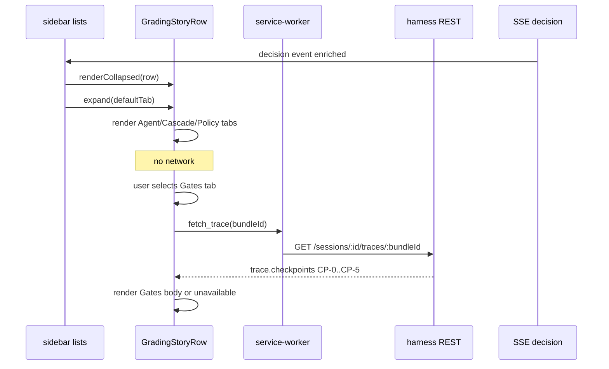

# feat: Grading Story Row (Unified Tabbed Explainability)

## Summary

Replace fragmented side-panel explainability (inline chips, row-click trace accordion, mixed reason lists) with one **Grading Story Row** component — collapsed action/score/confidence/cascade chip, expanded four-tab card (Agent, Cascade, Gates, Policy) — wired into Recent Decisions, Filtered Posts, and checkpoint log click. Judges answer LLM-ran, gate-failed, and why-HOLD questions in under 30 seconds without server logs. (see origin: brainstorm R1–R16, SC1–SC2)

---

## Problem Frame

Plans 007 and 009 shipped trace drill-down, cascade chips, and partial persistence, but explainability is still split across row-click accordions, inline policy strings, and list-specific renderers. Operators cannot jump to the demo beat they need (cascade vs gates vs harness policy) without scrolling or re-fetching. The requirements doc composes ideation #1–#4 into one surface; this plan implements that composition without session vitals, shadow grading, or timeline overlay (explicitly deferred in origin).

---

## Requirements

Requirements trace to origin R1–R16, flows F1–F3, acceptance AE1–AE5, success SC1–SC2.

### Harness — structured commit rationale and wire parity

- R1. `commitDecision()` emits a stable `commit_branch` enum and structured `commit_rationale` inputs (show threshold, confidence, reach/likes, guardrail outcome) separate from agent `agentReasons`.
- R2. Published decision SSE and REST hydration include `confidence`, `escalate`, full `agent_reasons`, `cascade_meta`, `commit_branch`, and `commit_rationale` when agent scoring ran; BLOCK omits agent fields.
- R3. Explainability fields persist on `decisions` insert so panel reopen matches live SSE (origin R15–R16).
- R4. All commit paths (ingest, tape replay, guardrail early exit, schema violation HOLD) call the shared publish helper with the same enriched shape.

### Side panel — Grading Story Row component

- R5. One shared row component renders in Recent Decisions, Filtered Posts, and checkpoint log click targets (origin R1).
- R6. Collapsed row: action, score, confidence bar with 0.5 threshold marker, cascade chip (`H`, `H→L`, optional `Δ≥15`) — agent reason codes only inside Agent tab (origin R2, R3 default Agent tab).
- R7. Expanded row: four tabs — Agent, Cascade, Gates, Policy. Entry from checkpoint log defaults to **Gates**; other entry points default to **Agent** (resolves origin OQ2).
- R8. Agent tab: full reasons, category, worker, confidence, escalate; explicit empty state when no agent ran (origin R5–R6).
- R9. Cascade tab: LLM invoked flag, heuristic pre-score, branch trigger, disagreement delta, latency (origin R7).
- R10. Gates tab: lazy-fetch bundle trace on first tab open only; loading skeleton; unavailable state when trace missing (origin R9–R11, R10).
- R11. Policy tab: harness branch + inputs + policy reason codes, visually separate from agent reasons (origin R12–R14).
- R12. Same bundle expanded from any entry point shows identical tab content (origin R4).

### Demo success

- R13. SC1: judge answers (1) LLM ran, (2) which gate failed *when a gate failed*, (3) why held — within 30s using the row alone. Policy-driven HOLD with all gates passed satisfies (3) via Policy tab without requiring a failed gate.
- R14. SC2: one shared component and tab model across three surfaces; only default tab differs by entry point (origin SC2, revised for OQ2).

---

## Key Technical Decisions

- KTD1: **Grading Story Row module before list wiring.** Extract `extension/sidebar/grading-story-row.js` (or equivalent) with `renderCollapsed(row)`, `renderExpanded(row, { activeTab })`, tab switch handlers, and Gates lazy-fetch state keyed by `bundleId`. Parent lists only supply row data and entry context.

- KTD2: **Expand ≠ trace fetch.** Supersedes plan 007 row-click → immediate trace accordion. Row expand shows Agent/Cascade/Policy from decision payload; `fetch_trace` runs only when Gates tab is first activated (origin R10). Reuse `renderTraceAccordion` internals for Gates tab body.

- KTD3: **Entry-aware default tab.** Checkpoint log click passes `{ defaultTab: 'gates' }`; decisions/filtered pass `{ defaultTab: 'agent' }`. Resolves origin OQ2 without forking row markup (origin R3).

- KTD4: **Structured Policy tab, not `policy_label` alone.** Extend harness beyond display string: `commit_branch` (`SCORE_ABOVE_THRESHOLD`, `SCORE_BELOW_THRESHOLD`, `LOW_CONFIDENCE_HIGH_REACH`, `AGENT_ESCALATION`, `GUARDRAIL_BLOCK`, `SCHEMA_VIOLATION`) plus `commit_rationale: { show_threshold, confidence, likes, guardrail_passed }`. Persist as JSON column; map in publish helper alongside existing `policy_label` for backward compatibility.

- KTD5: **Complete plan 009 data layer first.** Store schema and `explainabilityFields()` exist; guardrail/schema early exits still omit explainability on insert; REST filtered-decisions route does not yet return confidence/cascade/agent_reasons. U1–U2 finish parity before UI (origin D2, doc-review finding).

- KTD6: **Confidence bar, not tier badge only.** Horizontal 0–1 bar with 0.5 marker and numeric label; null confidence shows `N/A` on guardrail/schema paths (design-lens DL-009/010).

---

## High-Level Technical Design

---

## Scope Boundaries

**In scope:** Structured commit rationale; SSE/REST/persist parity; unified tabbed row; three entry points; Gates lazy load + loading/unavailable states; demo checklist updates.

**Deferred (per origin):** Session vitals (#5), shadow grading (#8), timeline ghost (#13), oversight SSE (#9), policy version stamps (#10), trace digest (#11–#12), alarm provenance drawer.

**Supersedes / refactors:** Plan 009 U4 compact+reason-expand approach — tabbed Grading Story Row replaces separate chevron expand and trace-on-row-click as primary explain surface. Trace accordion helpers remain as Gates tab renderer.

**Depends on:** Plan 007 trace API (shipped), plan 009 U1–U3 (complete or folded into U1–U2 here).

---

## System-Wide Impact

- **SQLite:** New `commit_rationale_json` column on `decisions` (nullable).
- **SSE:** Adds `commit_branch`, `commit_rationale`; ensures `confidence`, `escalate` on all scored paths.
- **Extension:** Refactor `sidebar.js` list renderers; new CSS for tabs, confidence bar, loading skeleton.
- **Demo:** Checkpoint beat uses same row as Filtered Posts — narrators no longer context-switch UI patterns.

---

## Risks & Dependencies

| Risk | Mitigation |
|------|------------|
| Plan 009 U4 partially landed (chips without tabs) | U4 deletes trace-on-click primary path; migrate to expand control |
| REST hydrate missing fields breaks refresh | U2 route mapper tests mirror publish-decision tests |
| F3 vs R7 default tab conflict | KTD3 entry-aware default; update SC2 wording in demo checklist |
| Gates fetch latency breaks 30s SC1 | Loading skeleton + cache trace per bundle after first fetch |
| Policy tab conflates agent/harness codes | KTD4 policy-only `reason_codes` from U1 |

---

## Implementation Units

### U1. Structured commit rationale (harness)

**Goal:** Plan R1, R11 — Policy tab data model (origin R12–R13, D2).

**Requirements:** R1, R11

**Dependencies:** None

**Files:**
- `harness/pipeline/decision.js`
- `harness/lib/commit-rationale.js` (new — branch enum + input builder)
- `harness/tests/decision.test.js`

**Approach:** Return `{ ...decision, commitBranch, commitRationale }` from `commitDecision()`. Map guardrail BLOCK, schema violation, threshold branches, HOLD branches to enum values. Keep `buildPolicyLabel()` as human-readable derivative for chips if still used in collapsed row.

**Test scenarios:**
- SHOW 62 → `SCORE_ABOVE_THRESHOLD`, rationale includes threshold 40
- HOLD low-confidence high-reach → `LOW_CONFIDENCE_HIGH_REACH`, likes + confidence in rationale
- Guardrail BLOCK → `GUARDRAIL_BLOCK`, no agent fields

**Verification:** Decision unit tests assert branch + inputs; no agent strings in `reasonCodes`.

---

### U2. Persist and publish explainability parity

**Goal:** Origin R2–R4, R15–R16; finish plan 009 gaps.

**Requirements:** R2, R3, R4

**Dependencies:** U1

**Files:**
- `harness/db/schema.sql`
- `harness/db/store.js`
- `harness/pipeline/processor.js` (all `insertDecision` call sites + `explainabilityFields`)
- `harness/lib/publish-decision.js`
- `harness/routes/sessions.js` (filtered + recent decisions mappers)
- `harness/replay/tape-player.js`
- `harness/routes/sessions.js` (HITL resolve publish path)
- `shared/schemas/decision.json`
- `harness/tests/publish-decision.test.js`
- `harness/tests/filtered-decisions.test.js`

**Approach:** Add `commit_rationale_json` column. Thread `commitBranch`/`commitRationale` through insert and publish. Extend REST GET mappers to emit snake_case `agent_reasons`, `confidence`, `escalate`, `cascade_meta`, `commit_branch`, `commit_rationale`. Fix early-exit inserts (guardrail block, schema violation) to still publish consistent BLOCK/HOLD shapes.

**Test scenarios:**
- Covers AE1/AE2 publish shape: confidence + cascade_meta + agent_reasons
- Covers AE4: BLOCK omits agent fields
- GET filtered decisions returns same fields as last SSE event
- Panel reopen hydrate: insert → GET → payload matches

**Verification:** `npm test` in harness workspace; schema validates enriched decision event.

---

### U3. Grading Story Row module — collapsed + tab shell

**Goal:** Plan R5–R7, R12, R14 — row shell and default tab (origin R1–R4, OQ2); KTD1, KTD6.

**Requirements:** R5, R6, R7, R12, R14

**Dependencies:** U2 (normalized row shape)

**Files:**
- `extension/sidebar/grading-story-row.js` (new)
- `extension/sidebar/sidebar.css`
- `extension/sidebar/panel.html` (if tab ARIA markup needs hooks)

**Approach:** Export `mountGradingStoryRow(li, row, { entryPoint })` — renders collapsed HTML, attaches expand toggle (chevron), on expand injects tab strip + panel container. Track `expandedBundleId` globally (one expanded row per panel). `renderConfidenceBar(value)` with 0.5 marker. `formatCascadeChip` moved/shared from sidebar.

**Test scenarios:**
- Manual: collapsed shows action, score, bar, chip — no reason codes visible
- Expand from Filtered → Agent tab active
- Expand from checkpoint log → Gates tab active
- Second row expand collapses first

**Verification:** Visual demo on `demo-v1` replay; no duplicate expand state across lists.

---

### U4. Tab renderers — Agent, Cascade, Policy

**Goal:** Plan R8, R9, R11 — tab renderers (origin R5–R7, R12–R14).

**Requirements:** R8, R9, R11

**Dependencies:** U3

**Files:**
- `extension/sidebar/grading-story-row.js`
- `extension/sidebar/sidebar.css`

**Approach:** **Agent:** ordered `agent_reasons`, category, worker, confidence, escalate; empty-state copy for BLOCK/pre-agent. **Cascade:** branch_trigger, heuristic_score, llm_invoked, disagreement_delta, latency_ms, gray-band hint from meta. **Policy:** `commit_branch` label, rationale inputs table, harness `reason_codes` list — never merge with agent reasons.

**Test scenarios:**
- Covers AE1, AE2, AE3, AE4 tab content
- AE3: Policy shows LOW_CONFIDENCE_HIGH_REACH while Agent shows agent reasons separately

**Verification:** Manual tab switching during demo rehearsal; AE3 HOLD narrative without gate failure.

---

### U5. Gates tab — lazy trace fetch

**Goal:** Plan R10 — Gates lazy fetch and unavailable state (origin R9–R11); KTD2.

**Requirements:** R10

**Dependencies:** U3, U4

**Files:**
- `extension/sidebar/grading-story-row.js`
- `extension/background/service-worker.js` (confirm `fetch_trace` handler)
- Reuse `renderTraceStage` / `renderTraceAccordion` from `sidebar.js` (extract or import)

**Approach:** On first Gates tab select for `bundleId`, show loading skeleton, call `fetch_trace`, cache result in `Map`. Render CP-0..CP-5 pass/fail; on error/null show unavailable message (AE5). Do not fetch on row expand or other tabs.

**Test scenarios:**
- Covers AE5: trace 404 → unavailable copy; Agent/Cascade/Policy still populated
- Gates second visit → cache hit, no second fetch
- Collapse row mid-fetch → complete fetch, cache for re-expand

**Verification:** Network tab shows trace only on Gates tab activation; demo checkpoint beat F3.

---

### U6. Wire three entry points + remove legacy paths

**Goal:** Origin R1, F1–F3; supersede trace-on-click primary UX.

**Requirements:** R5, R7, R12, R13, R14

**Dependencies:** U3, U4, U5

**Files:**
- `extension/sidebar/sidebar.js`
- `extension/sidebar/grading-story-row.js`

**Approach:** Replace `renderFilteredRow` / decision prepend HTML with `mountGradingStoryRow`. Checkpoint log click: resolve `bundle_id`, find or synthesize row from latest decision + trace stub, expand with `entryPoint: 'checkpoint'`. Remove `toggleTraceAccordion` row-click handler; keep trace renderers for Gates tab. Held queue: optional reuse of collapsed row only (Policy tab for HOLD) — full Held parity deferred unless trivial via shared normalizer.

**Test scenarios:**
- F1 Recent Decisions expand → all tabs
- F2 Filtered HIDE → Policy + Gates
- F3 checkpoint click → Gates default
- SC1 manual timing: three judge questions < 30s on anchor bundles from plan 007 kit

**Verification:** Demo checklist rows updated; no row-click trace accordion in DOM.

---

### U7. Demo checklist and regression guard

**Goal:** SC1–SC2 verifiable.

**Requirements:** R13, R14

**Dependencies:** U6

**Files:**
- `docs/demo-checklist.md`
- `harness/tests/publish-decision.test.js` (extend if needed)

**Approach:** Add checklist steps for tab defaults, confidence bar, policy HOLD without failed gate, Gates lazy load. Note anchor bundles: `demo-bait-0`, `demo-borderline-0`, `demo-signal-0`.

**Verification:** `npm test` green; manual demo script walkthrough.

---

## Acceptance Examples (traceability)

| ID | Scenario | Primary units |
|----|----------|---------------|
| AE1 | Heuristic SHOW — H chip, Policy branch | U1, U2, U4 |
| AE2 | Gray-band LLM — H→L chip, Cascade detail | U2, U4 |
| AE3 | Policy HOLD — harness branch not agent blame | U1, U4 |
| AE4 | Guardrail BLOCK — Agent empty, Gates CP-1 | U4, U5 |
| AE5 | Trace unavailable — Gates message only | U5 |

---

## Resolved Planning Questions

| Origin OQ | Resolution |
|-----------|------------|
| OQ1 Gates placeholder vs full four-tab merge | Ship all four tabs; Gates uses existing trace API; R10 unavailable only on fetch failure — not a permanent placeholder |
| OQ2 Default tab from checkpoint log | Gates default when `entryPoint === 'checkpoint'`; Agent default otherwise (KTD3) |

---

## Sources & Research

- Origin: `docs/brainstorms/2026-06-13-grading-story-row-requirements.md`
- Ideation: `docs/ideation/2026-06-13-agent-grading-observability-ideation.md` (#1–#4)
- Trace API: `docs/plans/2026-06-13-007-feat-explain-this-post-demo-slice-plan.md` (completed)
- Data layer partial: `docs/plans/2026-06-13-009-feat-post-score-explainability-phase-a-plan.md` (active — U1–U3 folded into U1–U2 here)
- Publish pattern: `harness/lib/publish-decision.js`, `harness/lib/cascade-meta.js`
- UI baseline: `extension/sidebar/sidebar.js` (`renderExplainChips`, `toggleTraceAccordion`)
