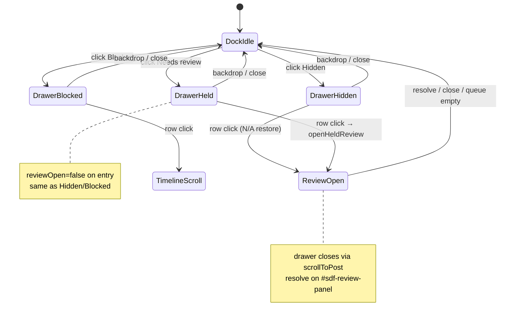

# feat: Held Drawer Dock Consistency

## Summary

Make the timeline dock **Needs review** button behave like **Hidden** and **Blocked**: always visible with a count badge, opens the shared slide-out drawer with a list of held posts, and routes row clicks to the existing floating review panel for resolve. No harness or sidebar changes required.

## Problem Frame

The timeline operator dock (`extension/content/filter-ui.js`) exposes three queues — Hidden, Blocked, and Needs review — but only the first two follow a consistent pattern. Hidden and Blocked buttons are always rendered, open `#sdf-hidden-drawer` in the matching mode, and list all matching posts. Needs review is conditional (hidden when count is zero), toggles a separate floating `#sdf-review-panel` on dock click, and shows a single post instead of a queue list.

Operators triaging HITL during demo rehearsal must discover the review panel indirectly or use the sidebar held section. The dock affordance should mirror Hidden/Blocked so all three queues are browsable from the same drawer surface before resolve.

---

## Requirements

- R1. **Needs review dock button is always visible**, including when pending count is zero (badge shows `0`).
- R2. **Dock click opens the shared drawer** in a held mode — same open/close semantics as Hidden and Blocked (backdrop, × close; no toggle-to-review-panel on dock click alone).
- R3. **Drawer lists all held posts** currently hydrated from `fetch_held`, sorted newest first, using the same card density as Hidden/Blocked rows (author, snippet, reasons, score).
- R4. **Drawer empty state** when no posts are held: copy equivalent to Hidden/Blocked empty states (“No posts need review yet…”).
- R5. **Row click opens review for that post**: scroll to timeline, highlight overlay, open floating `#sdf-review-panel` with resolve actions — via existing `openHeldReview(bundleId)`; resolve buttons stay on the review panel, not in drawer cards.
- R6. **Mutual exclusion**: opening Hidden, Blocked, or Held drawer sets `reviewOpen = false`; opening review from a held drawer row closes the drawer (existing `scrollToPost` behavior).
- R7. **Count badge uses API total** (`payload.total` from `fetch_held`), not only `heldPosts.length`, so queues above the 20-row cap display the correct dock count; drawer shows overflow footer when `total > 20`.
- R8. **Sidebar held section unchanged** — observe-and-jump only; this plan fixes timeline dock parity, not panel resolve UX (see plan 005 K1).
- R9. **After resolve**, dock count, drawer list, and review panel advance/close via existing `refresh()` + `held_count` SSE without panel reload.

---

## Key Technical Decisions

- KTD1: **Third drawer mode `held`, not a fourth panel.** Extend `drawerMode` to `'hidden' | 'blocked' | 'held'` and reuse `#sdf-hidden-drawer` + `renderDrawerList()`. Avoids a second list surface and matches Hidden/Blocked CSS/animation. Rationale: user asked for consistency with blocked/hidden buttons that already share one drawer.
- KTD2: **Dock click opens list only; resolve stays on `#sdf-review-panel`.** Replace today's `reviewOpen = !reviewOpen` dock handler with the Hidden/Blocked pattern (`drawerMode = 'held'`, `drawerOpen = true`, `reviewOpen = false`). Row click calls `openHeldReview`. Preserves plan 005 K1 and demo AE6 resolve-on-timeline contract.
- KTD3: **Track `heldTotal` in filter-ui like sidebar `hydrateHeld`.** Store `payload.total` from `fetch_held` separately from `heldPosts` rows array. Dock badge and review header “N pending” use `heldTotal`; drawer overflow footer mirrors sidebar `+N more in queue`.
- KTD4: **Drawer list uses simplified held cards, not grading-story rows.** Match existing drawer card template (`.drawer-card-clickable`, `.sdf-action-tag.hold`); reasons from `agentReasons` or `scoreExplanation`. Sidebar GSR rows remain richer observability; drawer stays operator-triage density per hidden/blocked precedent.
- KTD5: **Harden `openHeldReview` missing-bundle path.** After `refresh()`, if requested `bundleId` is absent from `heldPosts`, do not fall back to `heldPosts[0]` silently — skip review panel open and leave drawer/list refreshed. Closes race when sidebar message arrives after resolve.
- KTD6: **Drawer list sort stays API order; promotion affects review target only.** `openHeldReview` may reorder `heldPosts` for `renderReview()` target selection, but `renderDrawerList` for held mode re-sorts by `createdAt` desc from current `heldPosts` (or a snapshot) so the list does not jump unexpectedly while open.

---

## High-Level Technical Design

**Interaction summary:** three dock buttons → one drawer, three modes. Held mode is list-only; resolve is always on the floating panel or inline tweet actions (`overlay.js`), never in drawer cards.

---

## Scope Boundaries

**In scope:** `extension/content/filter-ui.js` state/handlers, held branch in `renderDrawerList` / `renderDrawer`, optional `.drawer-overflow` styling in `extension/shared/overlay.css`, optional demo checklist note for dock held path.

**Out of scope:**
- Resolve buttons in drawer or sidebar
- Harness / REST shape changes (`fetch_held` already sufficient)
- Score-based sort modes (ideation doc — lists stay time-ordered)
- Drawer tabs UI (CSS exists, unused)
- Auto-opening held drawer on `escalation_queue_full` (sidebar already pulses Held section)
- Extension unit test infrastructure (none exists today)

### Deferred to Follow-Up Work

- “View held queue →” link from review panel (symmetry with “View blocked posts →”)
- Shared `normalizeHeldRow` extracted to a common module (sidebar + filter-ui duplicate today)
- Shoreline / score sort for held drawer triage

---

## Implementation Units

### U1. Held drawer mode and dock parity

**Goal:** Needs review button always visible; dock click opens held drawer like Hidden/Blocked.

**Requirements:** R1, R2, R6

**Dependencies:** none

**Files:**
- `extension/content/filter-ui.js`
- `extension/shared/overlay.css` (only if active-state styling needed)

**Approach:** Always render third dock button in `renderDock()` with count from `heldTotal`. Change review dock click handler to set `drawerMode = 'held'`, `drawerOpen = true`, `reviewOpen = false`, then `renderDrawer()` + `renderReview()`. Update `renderDrawer()` title/subtitle for held mode (“Posts needing review” / “Borderline posts awaiting your call.”). Remove conditional `held ? ... : ''` wrapper around the button.

**Patterns to follow:** Hidden/Blocked handlers at dock click (`drawerMode`, `drawerOpen`, `reviewOpen = false`).

**Test scenarios:**
- Happy path: with 2 held posts, click Needs review → drawer opens with held title and 2 cards; review panel not visible.
- Edge case: with 0 held posts, Needs review button still visible with badge `0`; drawer opens to empty state copy.
- Integration: click Hidden while held drawer open → drawer shows hidden list, review panel stays closed.

**Verification:** Manual on X timeline — three dock buttons always present; Needs review never toggles review panel directly on dock click.

---

### U2. Held drawer list rendering and overflow

**Goal:** Drawer lists held posts with card shape matching Hidden/Blocked and overflow when queue exceeds cap.

**Requirements:** R3, R4, R7

**Dependencies:** U1

**Files:**
- `extension/content/filter-ui.js`
- `extension/shared/overlay.css`

**Approach:** Add held branch in `renderDrawerList()`: filter/sort `heldPosts` by `createdAt` desc; map to drawer cards with HOLD tag, `@author`, snippet, joined `agentReasons` or `scoreExplanation`, optional score. Row uses `data-held-review="${bundleId}"` (not bare `data-find`) with click → `openHeldReview(bundleId)`. Empty branch copy per R4. When `heldTotal > heldPosts.length`, append drawer footer `+N more in queue`. Optional CSS class `.drawer-overflow` mirroring sidebar `.section-overflow`.

**Patterns to follow:** `renderDrawerList()` HIDE/BLOCK card template; `sidebar.js` `renderHeldList` overflow footer logic.

**Test scenarios:**
- Happy path: held row shows author, snippet, reasons, score consistent with sidebar row for same bundle.
- Edge case: API returns `{ rows: 20, total: 23 }` → dock badge `23`, drawer shows 20 cards + “+3 more in queue”.
- Edge case: post missing `authorHandle` → falls back to `reviewContext()` / cached meta / `'unknown'`.
- Integration: click held drawer row → drawer closes, timeline scrolls, review panel opens for that bundle.

**Verification:** Queue with >20 held posts (or mocked total) shows correct badge and overflow; empty queue shows empty copy only.

---

### U3. Hydrate heldTotal and harden openHeldReview

**Goal:** Counts stay accurate; row navigation never opens wrong post after stale messages.

**Requirements:** R5, R7, R9

**Dependencies:** U1, U2

**Files:**
- `extension/content/filter-ui.js`

**Approach:** In `refresh()`, parse `heldPayload.total` into module-level `heldTotal`; normalize held rows (inline helper mirroring `sidebar.js` `normalizeHeldRow` fields needed for drawer). Update `renderDock()` and `renderReview()` pending count to use `heldTotal`. In `openHeldReview`, after `refresh()` when bundle missing locally, verify `bundleId` exists in `heldPosts` before `showReview()`; if missing, abort review open. Align review panel header count with `heldTotal`. Keep post-resolve `refresh()` auto-advance when `reviewOpen && heldPosts[0]`.

**Patterns to follow:** `sidebar.js` `hydrateHeld(rows, total)`; plan 005 KTD4 promotion-before-render.

**Test scenarios:**
- Happy path: resolve SHOW on review panel → `heldTotal` decrements, dock badge updates, drawer list removes row if still open.
- Error path: `open_held_review` message for resolved bundle → no review panel; list refreshes without showing `heldPosts[0]` incorrectly.
- Integration: sidebar row click and drawer row click for same bundle both open review panel with matching reasons.
- Edge case: resolve last held post → review panel hides (`!heldPosts.length`); held drawer shows empty state if still open.

**Verification:** Stale `open_held_review` does not surface wrong post; counts match sidebar held stat for same session.

---

### U4. Demo documentation touch (optional)

**Goal:** Document dock held path alongside sidebar AE6 rehearsal.

**Requirements:** R9 (demo reliability)

**Dependencies:** U1–U3

**Files:**
- `docs/demo-checklist.md`

**Approach:** Add optional AE6 sub-path: “Needs review dock → drawer list → click row → floating card resolve → count decrements.” One bullet; no script rewrite.

**Test scenarios:**
- Test expectation: none — documentation only.

**Verification:** Demo checklist mentions both sidebar and dock entry points to the same resolve surface.

---

## Risks & Dependencies

| Risk | Mitigation |
|------|------------|
| Drawer z-index blocks review panel if left open | Close drawer on row click via existing `scrollToPost` / `openHeldReview` path (KTD2) |
| `heldPosts` promotion reorders drawer while open | Re-sort in `renderDrawerList` from stable fields (KTD6) |
| Duplicate normalize logic drifts from sidebar | Inline mirror for v1; defer shared module to follow-up |
| No automated extension tests | Manual regression checklist in U1–U3 verification |

**Dependencies:** Existing `fetch_held`, `open_held_review`, `resolve_held` service-worker messages; no harness changes.

---

## Sources & Research

- Timeline dock/drawer: `extension/content/filter-ui.js`, `extension/shared/overlay.css`
- Sidebar held queue pattern: `extension/sidebar/sidebar.js` (plan 005)
- HITL resolve contract: `docs/plans/2026-06-13-005-feat-held-queue-sidebar-plan.md` K1, KTD4
- Hidden/Blocked drawer precedent: `docs/plans/2026-06-13-004-feat-hidden-posts-observability-plan.md`
- Spec-flow edge cases: heldTotal tracking, missing-bundle gate, mutual exclusion (internal analysis)
