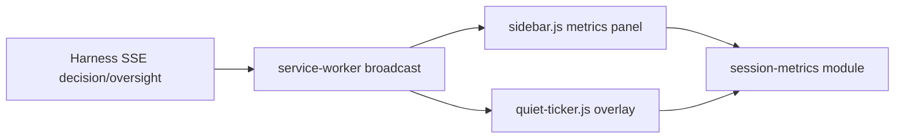

# feat: Session Metrics (SNR, Filter Rate, Quiet Ticker, AE1 Probe)

## Summary

Add demo-visible session metrics so judges see filtering work without opening the side panel: sidebar **filter rate** and **SNR** with AE1 readiness (≥70% hide/block on 30+ posts), plus a **Live Quiet Ticker** on x.com during scroll. Pure metric logic lives in a shared module tested by the harness.

---

## Problem Frame

Grading vitals (LLM %, confidence, disagreements) exist in the sidebar but the success criterion is *"my feed got quiet while I watched."* AE1 (70% hide/block on live scroll) is unvalidated and invisible when the panel is closed. Competitors surface session stats (SNR, time saved); our pipeline already emits decisions — metrics are a presentation gap, not a harness gap.

---

## Requirements

- R1. **Filter rate** — `(HIDE + BLOCK) / total_committed_decisions`, displayed as percentage in sidebar.
- R2. **SNR (signal fraction)** — `SHOW / total_committed_decisions`, displayed as percentage in sidebar.
- R3. **Session counts** — show, hide, block, hold tallies visible alongside rates.
- R4. **AE1 probe** — after 30+ committed decisions, show `READY` when filter rate ≥ 70%, else `BELOW` with current rate; before 30 show `Collecting (n/30)`.
- R5. **Live Quiet Ticker** — fixed overlay on x.com timeline showing filter rate and last action; pulse on HIDE/BLOCK; dismissible; works with panel closed.
- R6. **Oversight parity** — operator HOLD → SHOW/HIDE/BLOCK resolutions count toward session metrics via `oversight` SSE.
- R7. **Hydrate on panel open** — recount metrics from hydrated decision rows so reopening panel restores accurate totals.

### Demo success

- SC1. Operator scrolls 30s with panel closed and can read non-zero filter activity from ticker alone.
- SC2. Sidebar shows filter rate crossing 70% on `demo-v1` replay with anchor corpus.

---

## Key Technical Decisions

- KTD1: **Canonical metric module in `harness/lib/session-metrics.js`.** ESM exports for testability. Browser copy at `extension/shared/session-metrics.js` (IIFE → `window.sdfSessionMetrics`) mirrors formulas — keep in sync comment at top.

- KTD2: **Filter rate = quiet rate for AE1.** `(hide + block) / total` matches demo checklist AE1 ("HIDE or BLOCK overlay"). HOLD excluded from numerator but included in total.

- KTD3: **Client-side accumulation only.** No new harness endpoints; both sidebar and ticker derive from SSE `decision` and `oversight` events already broadcast.

- KTD4: **Ticker placement.** Bottom-left fixed pill on x.com home; uses design tokens; `pointer-events: none` on container, dismiss button `pointer-events: auto`.

- KTD5: **No ghost receipt / strictness dial.** Metrics slice only; deferred observability items stay out of scope.

---

## High-Level Technical Design

---

## Scope Boundaries

### In scope

- Shared metric formulas + harness tests
- Sidebar metrics section + AE1 badge
- Content-script quiet ticker + CSS
- Manifest wiring for new script + stylesheet

### Deferred to Follow-Up Work

- Harness-persisted session summary export
- Feed Cleaner "time saved" estimate
- ECG waveform visualization
- Strictness dial affecting metrics mid-session

### Outside this product's identity

- Timeline DOM reorder by score
- New SSE event types from harness

---

## Implementation Units

### U1. Session metrics module

**Goal:** Pure functions for counts, filter rate, SNR, AE1 probe status.

**Requirements:** R1–R4, R6

**Files:**
- Create `harness/lib/session-metrics.js`
- Create `extension/shared/session-metrics.js`
- Create `harness/tests/session-metrics.test.js`

**Approach:** `createSessionMetrics()`, `applyDecision(metrics, action)`, `applyOversight(metrics, resolution)`, `computeFilterRate`, `computeSnr`, `ae1ProbeStatus`, `formatMetricsSummary`.

**Patterns to follow:** `harness/pipeline/decision.js` action enum SHOW/HIDE/HOLD/BLOCK

**Test scenarios:**
- Empty metrics → null rates, probe collecting 0/30
- 21 hide + 9 show → filter rate 0%, SNR 30% — wait 21 hide + 9 block = 30 hide+block of 30? 21 HIDE + 9 BLOCK of 30 total → 70% filter rate READY
- 29 decisions → probe still collecting
- Oversight resolution SHOW increments show count
- Unknown action ignored

**Verification:** `npm test` passes new session-metrics tests.

---

### U2. Sidebar metrics panel

**Goal:** Render filter rate, SNR, counts, AE1 badge; update on decision/oversight/hydrate.

**Requirements:** R1–R4, R6, R7

**Dependencies:** U1

**Files:**
- Modify `extension/sidebar/sidebar.html`
- Modify `extension/sidebar/sidebar.css`
- Modify `extension/sidebar/sidebar.js`

**Approach:** Session metrics state object; `renderSessionMetrics()` after each decision, oversight, hydrate, reset on session change. AE1 badge classes: `ae1-collecting`, `ae1-ready`, `ae1-below`.

**Test scenarios:** Test expectation: none — UI wiring; logic covered in U1.

**Verification:** Replay `demo-v1`; sidebar shows rising filter rate and READY after 30 posts.

---

### U3. Live Quiet Ticker

**Goal:** Feed-visible metrics overlay during scroll.

**Requirements:** R5, R6

**Dependencies:** U1

**Files:**
- Create `extension/content/quiet-ticker.js`
- Create `extension/shared/quiet-ticker.css`
- Modify `extension/manifest.json`

**Approach:** Listen `chrome.runtime.onMessage` for `decision` and `oversight`; update ticker text; add `sdf-ticker-pulse` class on HIDE/BLOCK; dismiss persists in `sessionStorage`.

**Test scenarios:** Test expectation: none — DOM overlay; formulas in U1.

**Verification:** Scroll x.com/replay with panel closed; ticker shows filter ratio updating.

---

### U4. Demo checklist update

**Goal:** Document manual verification for new metrics surfaces.

**Requirements:** SC1, SC2

**Dependencies:** U2, U3

**Files:**
- Modify `docs/demo-checklist.md`

**Approach:** Add AE1b section for sidebar metrics + ticker.

**Test scenarios:** Test expectation: none — documentation.

**Verification:** Checklist items match shipped UI labels.

---

## Acceptance Examples

- **AE1b — Session metrics:** Given replay of `demo-v1`, when 30+ decisions stream, then sidebar filter rate ≥ 70% and AE1 badge shows READY; quiet ticker shows matching ratio with panel closed.

---

## Risks & Dependencies

- Ticker may overlap X.com bottom chrome on small viewports — use safe-area inset and dismiss.
- Hydrate recount must not double-count if both SSE and hydrate fire — reset metrics on hydrate then replay rows once.

---

## Sources & Research

- Ideation refinement: metrics gap map (sidebar vs timeline vs export)
- `docs/demo-checklist.md` AE1 (70% hide/block)
- `extension/sidebar/sidebar.js` existing vitals pattern
