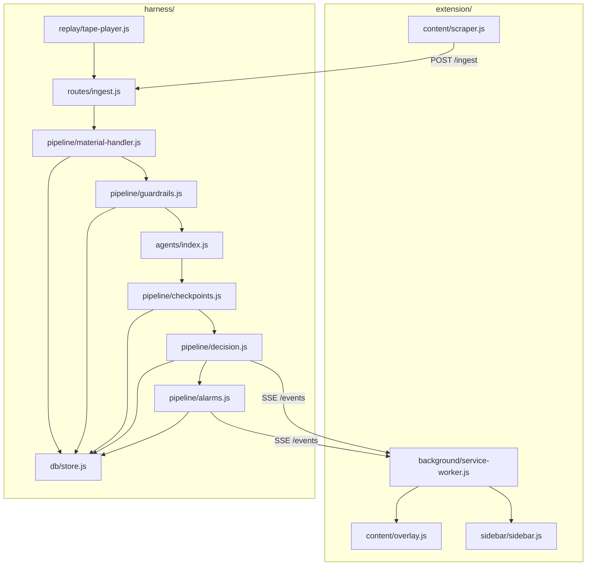

# Signal Density Filter — Hackathon Implementation Plan

## Summary

Build a Chrome MV3 extension and local Node.js harness that aggressively filters a live X.com timeline for a 5-minute judge demo. Live scrolling is the headline; session replay is an invisible fallback. The harness implements four named pillars — Material Handler, Guardrails, Checkpoints, and Alarms — with swappable LLM and heuristic scoring workers. (see origin: `docs/brainstorms/2026-06-13-signal-density-filter-requirements.md`)

## Problem Frame

X.com feeds are noisy. The hackathon deliverable is a governed agentic harness that filters posts with named reason codes, checkpoint replay, and structured alarms — not another opaque fade filter. The builder is solo, has not validated against real feed content yet, and must rehearse a timed demo where all four pillars are narrated in five minutes.

## Requirements

Requirements trace to the origin brainstorm. IDs are continuous across groups.

### Demo experience

- R1. Primary demo path filters a live X.com timeline during normal-speed scrolling.
- R2. Default filter hides approximately 70% of posts in a noisy demo scroll.
- R3. Filter outcomes are visible on the native X timeline without leaving x.com.
- R4. Operator can switch from live to replay mid-pitch without changing extension UI layout.
- R5. Five-minute demo script includes one narrated beat per harness pillar.

### Harness pillars

- R6. Material Handler normalizes captured posts; the scoring worker never receives raw HTML.
- R7. Guardrails run before the agent and block with named reason codes.
- R8. Checkpoints gate agent output; runs persist checkpoint stage and support replay from a chosen gate.
- R9. Alarms stream to the extension sidebar in real time during live and replay modes.

### Filtering and workers

- R10. Harness commits SHOW (score ≥ 40), HIDE (score < 40), HOLD, or BLOCK per post.
- R11. Escalation flag or low-confidence on high-reach accounts routes to HOLD.
- R12. Every rejection and hold exposes a named reason code to the operator.
- R13. Two scoring workers ship behind one interface: LLM (default) and heuristic (no API).
- R14. Worker swap requires configuration only, not harness code changes.
- R15. Demo includes a worker-swap beat on the same post set.

### Session, replay, HITL

- R16. Extension shows held-post count.
- R17. Operator can resolve a held post as Show, Hide, or Block with visible agent reasoning.
- R18. At least one borderline post is demonstrable; full queue UX is optional.
- R19. Live sessions record automatically for later replay.
- R20. Replay emits the same decision and alarm events the extension expects in live mode.
- R21. Replay supports starting from a named checkpoint gate and swapping workers mid-replay.

## Key Technical Decisions

- KTD1: **Dual-mode ingest, single pipeline.** Live capture and tape replay both produce the same normalized post shape before Material Handler. Replay mode stops scraping; extension consumes SSE only. Resolves origin OQ1 via operator hotkey `Alt+Shift+R` bound in the service worker — no auto-detection. (see origin: R4, R19, R20)

- KTD2: **Agent scores; harness decides.** Workers return `{ signal_score, category, reasons[], confidence, escalate }`. Harness owns SHOW/HIDE/HOLD/BLOCK, persistence, alarms, and replay. Worker selection via `AGENT=llm|heuristic` environment variable.

- KTD3: **Tiered scoring cascade.** Heuristic scores every post first. LLM runs only on gray band (score 30–60), `escalate: true`, or heuristic/LLM disagreement. Prevents scroll latency from dominating the live demo.

- KTD4: **SQLite + JSONL tapes.** `better-sqlite3` for checkpoint traces and decisions. JSONL tapes under `tapes/` for portable rehearsal fixtures. Stable `bundle_id` per post across replay runs.

- KTD5: **SSE for harness → extension.** One `GET /events` stream carries `decision`, `alarm`, `checkpoint`, and `held_count` events. Extension stays thin; all policy lives server-side.

- KTD6: **Vanilla JS, no TypeScript.** Matches planning constraints and minimizes solo build overhead. JSON Schema in `shared/schemas/` validates contracts at checkpoint gates.

- KTD7: **Minimal category taxonomy.** Enum: `news`, `analysis`, `engagement_bait`, `personal`, `promo`, `noise`. Resolves origin OQ3 with the smallest set that satisfies checkpoint validation.

- KTD8: **HITL pre-staged for demo.** One borderline post seeded in `tapes/demo-v1/` with `escalate: true`. Minimal resolve UI in side panel; alarm-routed queue beyond that is stretch. Resolves origin OQ2 for v1 scope.

- KTD9: **Author history deferred.** Per-handle enrichment is out of v1 per brainstorm scope boundaries.

## High-Level Technical Design

### Checkpoint stages

| Stage | Name | Pass criteria |
|-------|------|---------------|
| CP-0 | normalized | Valid normalized post shape |
| CP-1 | guardrails_passed | No guardrail block |
| CP-2 | agent_scored | Worker returned valid output |
| CP-3 | schema_valid | Score 0–100, category in enum, reasons present |
| CP-4 | confidence_checked | Confidence present; escalation flag valid |
| CP-5 | decision_committed | SHOW/HIDE/HOLD/BLOCK written |

Replay from stage N reuses stored bundles and re-runs stages N through CP-5 only.

### Session modes

| Mode | Extension behavior | Harness behavior |
|------|-------------------|------------------|
| `live` | Scrape + POST ingest | Full pipeline + optional tape append |
| `record` | Same as live | Append each bundle to `tapes/{id}/posts.jsonl` |
| `replay` | SSE only, no scrape | Read tape line-by-line through pipeline |

## Implementation Units

Units are ordered for solo hackathon execution. Build synthetic/replay path before live X integration.

### U1. Project scaffold and shared contracts

**Goal:** Runnable monorepo with validated JSON schemas both runtimes share.

**Files:**
- `package.json` (npm workspaces: `harness`, `extension`)
- `shared/schemas/normalized-post.json`
- `shared/schemas/agent-output.json`
- `shared/schemas/decision.json`
- `shared/schemas/alarm.json`
- `.env.example`
- `README.md` (run instructions only)

**Tests:** `harness/tests/schemas.test.js` — ajv validates fixture examples against each schema.

**Scenarios:**
- Valid normalized post passes schema validation
- Agent output missing `confidence` fails schema validation
- Decision enum rejects unknown action values

**Traces:** R6, R8

---

### U2. SQLite persistence layer

**Goal:** Durable storage for sessions, bundles, checkpoint runs, decisions, and alarms.

**Files:**
- `harness/db/schema.sql`
- `harness/db/store.js`
- `harness/db/migrations.js` (inline init on boot)

**Tables:** `sessions`, `bundles`, `checkpoint_runs`, `decisions`, `alarms`, `held_posts`

**Tests:** `harness/tests/store.test.js`

**Scenarios:**
- Insert bundle with stable `bundle_id`; replay run references same id
- Checkpoint run records stage, status, reason_code, payload_json
- Query decisions by session_id returns ordered timeline

**Traces:** R8, R19, R21

---

### U3. Material Handler and ingest API

**Goal:** Accept raw post envelopes from extension or replay; emit normalized posts.

**Files:**
- `harness/pipeline/material-handler.js`
- `harness/routes/ingest.js`
- `harness/routes/sessions.js`
- `harness/server.js`

**Behavior:**
- Strip HTML, extract plain text and URLs
- Compute `content_hash` for dedupe
- Assign `bundle_id`, `session_id`, `ingest_source`
- `POST /ingest` accepts single post or batch
- `POST /sessions` creates session with mode

**Tests:** `harness/tests/material-handler.test.js`

**Scenarios:**
- HTML-heavy input becomes plain text only in normalized output
- Duplicate `content_hash` in same session flagged for guardrails
- Replay inject sets `ingest_source: tape`

**Traces:** R6, R19

---

### U4. Guardrails engine

**Goal:** Declarative pre-agent rules with named BLOCK reason codes.

**Files:**
- `harness/config/guardrails.yaml`
- `harness/pipeline/guardrails.js`

**Rules (from planning doc):** too_short, duplicate_24h, blocked_account, engagement_bait (regex), spam_domain, stale_post (>72h)

**Tests:** `harness/tests/guardrails.test.js`

**Scenarios:**
- Post under min length → BLOCK `GUARDRAIL_TOO_SHORT` before agent invoked
- Duplicate content_hash within 24h → BLOCK `GUARDRAIL_DUPLICATE`
- Engagement-bait regex match → BLOCK `GUARDRAIL_ENGAGEMENT_BAIT`
- Clean post passes through to agent stage

**Traces:** R7, R12; AE3

---

### U5. Scoring workers and tiered cascade

**Goal:** Heuristic and LLM workers behind one interface; cascade routes LLM calls.

**Files:**
- `harness/agents/interface.js` (score contract)
- `harness/agents/heuristic-classifier.js`
- `harness/agents/llm-classifier.js`
- `harness/agents/index.js` (factory from `AGENT` env)
- `harness/pipeline/cascade.js`

**Heuristic signals:** information density, citation presence, emoji density, CTA patterns

**Cascade:** heuristic always; LLM if score 30–60, escalate, or disagreement alarm

**Tests:**
- `harness/tests/heuristic-agent.test.js`
- `harness/tests/cascade.test.js`

**Scenarios:**
- Obvious bait post scores < 30 heuristic-only, no LLM call
- Borderline post scores 45 triggers LLM path
- `AGENT=heuristic` env skips LLM entirely
- Same post produces different scores after worker swap

**Traces:** R13, R14, R15; AE5

---

### U6. Checkpoints and decision engine

**Goal:** Six gate validation and SHOW/HIDE/HOLD/BLOCK commitment.

**Files:**
- `harness/pipeline/checkpoints.js`
- `harness/pipeline/decision.js`

**Tests:**
- `harness/tests/checkpoints.test.js`
- `harness/tests/decision.test.js`

**Scenarios:**
- Invalid category enum fails CP-3
- Score 39 → HIDE; score 40 → SHOW
- `escalate: true` → HOLD regardless of score
- Checkpoint failure persists reason without crashing pipeline

**Traces:** R8, R10, R11, R12

---

### U7. Synthetic tapes and replay CLI

**Goal:** Develop and demo without live X; replay from checkpoint with worker swap.

**Files:**
- `corpora/demo.yaml`
- `scripts/seed-tape.js`
- `scripts/replay.js`
- `harness/replay/tape-player.js`
- `tapes/demo-v1/manifest.json` (generated)
- `tapes/demo-v1/posts.jsonl` (generated)

**CLI:**
- `npm run seed:tape` — generate 50-post demo tape (40% bait, 20% signal, 15% borderline)
- `npm run replay -- --tape demo-v1`
- `npm run replay -- --tape demo-v1 --from CP-3 --agent heuristic`

**Tests:** `harness/tests/replay.test.js`

**Scenarios:**
- Full tape replay produces decisions without network
- Replay from CP-3 skips earlier stages, reuses bundle rows
- Worker swap on replay changes decision on at least one borderline post

**Traces:** R4, R20, R21; AE2, AE4

---

### U8. Alarms and SSE event stream

**Goal:** Structured alarms and real-time events to extension.

**Files:**
- `harness/pipeline/alarms.js`
- `harness/routes/events.js`

**Alarm types:** `schema_violation`, `high_block_rate`, `agent_latency`, `confidence_collapse`, `escalation_queue_full`

**SSE event types:** `decision`, `alarm`, `checkpoint`, `held_count`

**Tests:** `harness/tests/alarms.test.js`, `harness/tests/sse.test.js`

**Scenarios:**
- Block rate > 80% in window fires `high_block_rate`
- Agent latency > 2s fires `agent_latency`
- SSE client receives decision then alarm in order

**Traces:** R9

---

### U9. Chrome extension — scrape and overlay

**Goal:** Capture timeline posts, render filter outcomes on native X UI.

**Files:**
- `extension/manifest.json`
- `extension/content/scraper.js`
- `extension/content/overlay.js`
- `extension/background/service-worker.js`

**Overlay semantics:** green badge SHOW, red dim/hide HIDE, yellow badge HOLD

**Tests:** Manual checklist `docs/demo-checklist.md` (no automated E2E in v1)

**Scenarios:**
- Scraper extracts author, text, engagement stubs from visible posts
- Overlay applies within 500ms of decision event on replay tape
- MutationObserver handles newly scrolled posts

**Traces:** R1, R3

---

### U10. Side panel — alarms, checkpoints, mode switch

**Goal:** Visible pillar beats for alarms and checkpoint log; seamless replay switch.

**Files:**
- `extension/sidebar/sidebar.html`
- `extension/sidebar/sidebar.js`

**Behavior:**
- Live alarm stream with severity and recommended action
- Checkpoint log viewer (last N runs with stage/status)
- `Alt+Shift+R` triggers replay mode via service worker (KTD1)

**Traces:** R4, R5, R9

---

### U11. LLM scoring worker integration

**Goal:** Wire Anthropic API for default classifier after heuristic cascade path works.

**Files:**
- `harness/agents/llm-classifier.js` (prompt + structured JSON parse)
- `.env` (`ANTHROPIC_API_KEY`, `AGENT=llm`)

**Tests:** `harness/tests/llm-agent.test.js` (mocked API)

**Scenarios:**
- Valid API response parses to agent-output schema
- Malformed JSON triggers `schema_violation` alarm and HOLD fallback
- Prompt targets ~70% rejection on demo tape corpus

**Traces:** R2, R13

---

### U12. Session recording and live-to-replay fallback

**Goal:** Background tape capture during live; operator hotkey switches modes invisibly.

**Files:**
- `harness/replay/tape-recorder.js`
- Updates to `harness/routes/sessions.js`, `extension/background/service-worker.js`

**Behavior:**
- `RECORD_TAPE=demo-v1` appends each ingested bundle to JSONL during live
- Hotkey sets session mode `replay` with same `tape_id`; extension stops scrape, SSE continues

**Tests:** `harness/tests/recording.test.js`

**Scenarios:**
- Live session with recording produces replayable tape
- Mode switch mid-session does not reset overlay state
- Replay decisions match recorded live decisions for same bundles

**Traces:** R4, R19, R20; AE2

---

### U13. Minimal HITL flow

**Goal:** One demonstrable borderline post with resolve UI.

**Files:**
- `harness/routes/hitl.js`
- `extension/content/hitl-panel.js`
- Borderline post in `tapes/demo-v1/posts.jsonl` (seed data)

**Tests:** `harness/tests/hitl.test.js`

**Scenarios:**
- Held post appears in side panel with agent reasons
- Operator resolves Hide → decision updates, held_count decrements
- Resolution persists in SQLite

**Traces:** R16, R17, R18; AE6

---

### U14. Demo rehearsal artifacts

**Goal:** Timed 5-minute script, operator runbook, harness documentation.

**Files:**
- `HARNESS.md` (four pillars, agent swap, replay instructions)
- `docs/demo-script.md` (minute-by-minute beats from origin F3)
- `docs/demo-checklist.md` (AE1–AE7 manual verification)

**Traces:** R5; AE7

## Scope Boundaries

### Deferred for later

- Author history enrichment (brainstorm first cut)
- Full HITL queue management UX
- GraphQL shadow tap and bookmarklet ingest adapters
- Chrome Web Store packaging
- Cloud deployment and multi-user support

### Outside product identity

- Standalone replacement feed app
- Model training or fine-tuning

## Risks and Dependencies

| Risk | Mitigation |
|------|------------|
| X DOM selectors break | Rehearse on `tapes/demo-v1`; hotkey replay fallback (KTD1) |
| LLM latency behind scroll | Tiered cascade (KTD3); heuristic-only rehearsal mode |
| ~70% hide rate not achievable | Tune heuristic weights on demo tape before pitch; pre-seed obvious bait |
| Solo time overrun | Units U7–U8 deliver demoable harness before U9 live X work |
| API key missing at demo | `AGENT=heuristic` full demo still shows all pillars |

**Dependencies:** Node 20+, Chrome with MV3 extension sideload, Anthropic API key for LLM path, logged-in X.com account for live rehearsal.

## Acceptance Examples

Carried from origin; implementation must satisfy:

- AE1. 30+ posts, 60s scroll, ≥70% HIDE/BLOCK visible (R1–R3)
- AE2. Live ingest failure → replay → UI unchanged (R4, R20)
- AE3. Guardrail block shows named reason before agent runs (R7, R12)
- AE4. Replay from mid-checkpoint after worker change (R21)
- AE5. LLM vs heuristic different scores on same tape (R15)
- AE6. One HOLD resolve decrements count (R16–R18)
- AE7. Full script ≤ 5 minutes (R5)

## Open Questions

None blocking implementation. Resolved in KTDs:

- OQ1 → KTD1 (hotkey replay switch)
- OQ2 → KTD8 (pre-staged borderline post)
- OQ3 → KTD7 (minimal category enum)

## Build Sequence

| Phase | Units | Milestone |
|-------|-------|-----------|
| 1 — Contracts | U1, U2 | Schemas validate; DB initializes |
| 2 — Pipeline core | U3, U4, U5, U6 | Full pipeline on synthetic tape, heuristic only |
| 3 — Demo reliability | U7, U8 | Replay CLI + SSE; rehearse without X |
| 4 — Live client | U9, U10, U11 | Extension overlay on x.com; recording + hotkey |
| 5 — LLM + HITL | U11, U12, U13 | LLM path; one borderline resolve |
| 6 — Pitch prep | U14 | Timed rehearsal twice on replay |

**Critical path:** U7 before U9. Do not start live X scraping until replay demo passes AE4 and AE5 on `tapes/demo-v1`.

## Sources

- Origin requirements: `docs/brainstorms/2026-06-13-signal-density-filter-requirements.md`
- Harness planning document (user-provided PDF): four pillars, tech stack, 10-step build plan, alarm types, checkpoint gates
- Ideation survivor #1 Dual-Mode Demo Stack: ingest/governance separation, tape format, demo script structure
